Azure Data Factory
---

ADF is a fully managed serverless data integration solutions for ingesting, preparing and transforming all of your data at scale.

The generated data is in a variety of formats, ranging from structrued, semi-structured and unstructured.

This data should be processed and ingested quickly in a consistent manner so that they can gain insights from the data and realize benefits.

ADF provides the ability to ingest data from various data sources like AWS S3, Google Cloud Storage, also from On-Premise services.

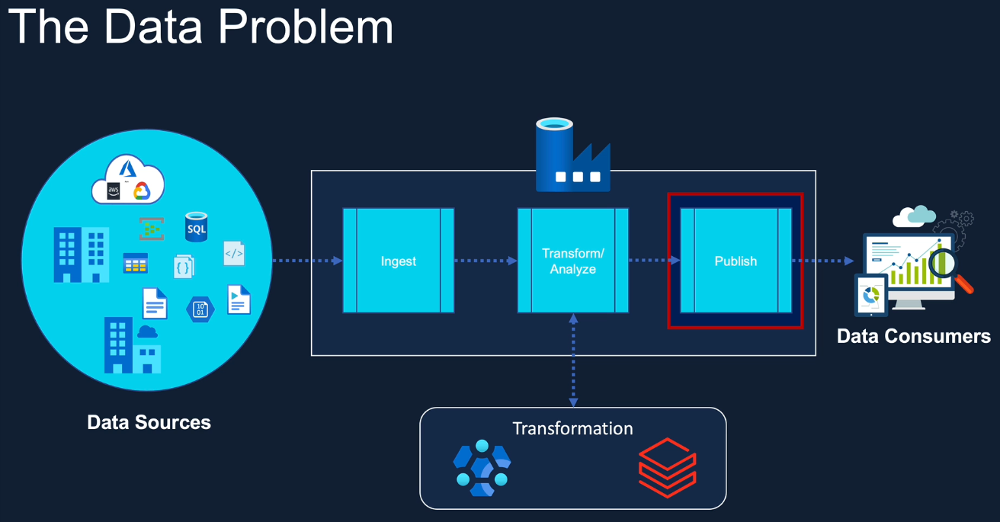

ADF Provides ability to transform and analyze the data. But, Transformations is limited only. To transformation in complex data is not available in ADF and its too complex.

We can orchestrate those transformations from the ADF.

Also, If we created ML Model in Azure ML or in Databricks, we can orchestrate the executions of those from ADF.

We will create our transformations and analytical script in Azure Databricks Notebooks and we will orchestrate them by our ADF.

Additionally, ADF also allow us to orchestrate the publishing of dashborads created in tools like `Power BI`.

Basically, ADF provides and `End to End Solutions` for `Data Integratinos`, `Transformations`, `Orchestrations`.

`Once data has processed, the data will writtern to a storage solutions like` **SQL Database** or **ADSL Gen2**

# ADF Archetectures

**Storage**

- Whatever actions we want to perform in ADF, it will requires Access to Storage Solutions such as ADLS, SQL Database.

**Compute**

- Provided by Azure databricks or HD Insights Clusters.

- Also it could be the serverless compute provided by ADF itself.

- Once we created a pipeline in ADF, we need to know how to Access these Resources like Storage or Computes.

**Linked Service** - For these we will create a `Linked Service`.

**DataSet** - Once we create linked services we would have to define our data structure in which formate data should store ?, Name of the file within a containers ? etc.

- This type of informations will stores in `DataSet`

- **Actions** - Using the connection informations, we may want to execute a process like, `Execute Databrick Notebooks` 

- **Pipelines** - To execute No. of tasks one by one by making dependencies between them we can use Pipelines.

- **Trigger** - We can also automate to trigger this pipelines based on Events, on Scheduled time we will use `Trigger`.

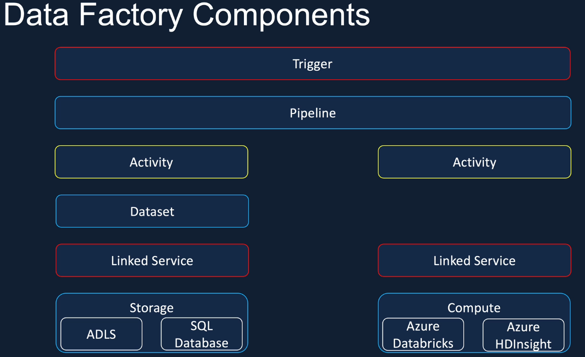

Create First Ingest Pipeline by ADF
---

## Pre-Requistes Required

### 1. Linked Services - For Access Resources

- To communicate ADF with Other services like Azure ML , Azure Databrick.

- For each services we will requires `Linked Servcies`.

- It will allow ADF to access those services.

- Create Linked Service

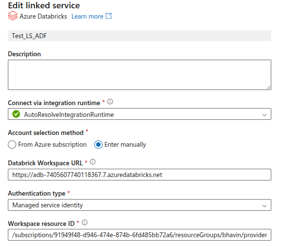

- Choose cluster node version and keep worker node 0 for Single Nodes.

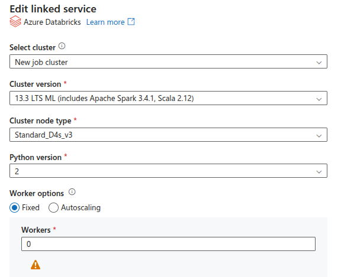

- Add Sparks Configuration to this `Job Cluster` to access Storage Account's Containers/* by ADF itself.

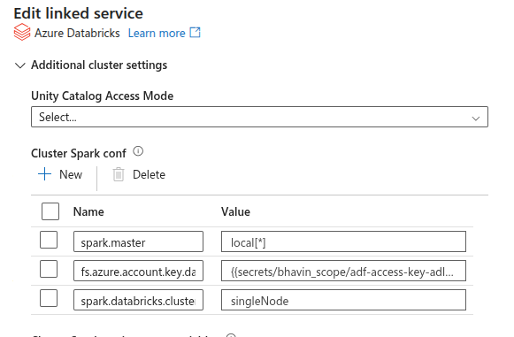

- Once you give Secret Scope Creds to this ADF Linked Services You will no longer required to give secret scope access in your Databrick Notebook.

### 2. Managed Identity - Perform Actions by ADF

- Once we give Access of Databrick to ADF, Now it will requies some Permissons to perform Azure Databrick WorkLoads by ADF Itself.

- For that we will create Managed Identity.

- Go to Databrick > IAM > Add role assignment

- Choose `Contributor` Role.

- Choose Managed Identity > ADF > `Managed Identity Name`.

## Create ADF Pipelines

- Add Databrick Notebook Activity

- Give your Notebook Path

- Give your Parameters widgets to control parameters passing value from ADF > Notebook.

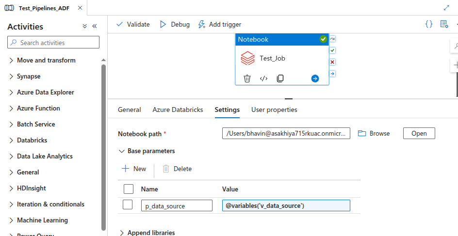

- Once Created Pipeline , Validate it and Debug it to execute pipelines.

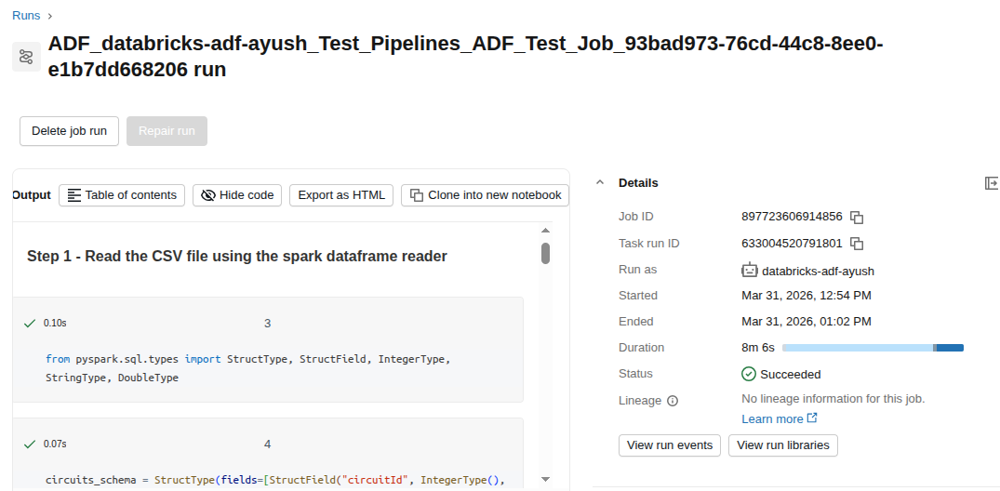

- Results

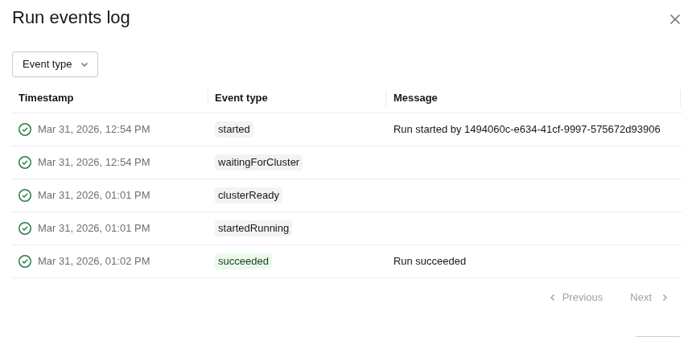

Create All Ingest Trigge Pipelines
---

- Create Clone for all Ingest files like Ingest_Circuits to Qualifying_Ingest Pipelies

- Update All files path where it is located in databricks workspace.

- Linke each other Activity

- Debug it.

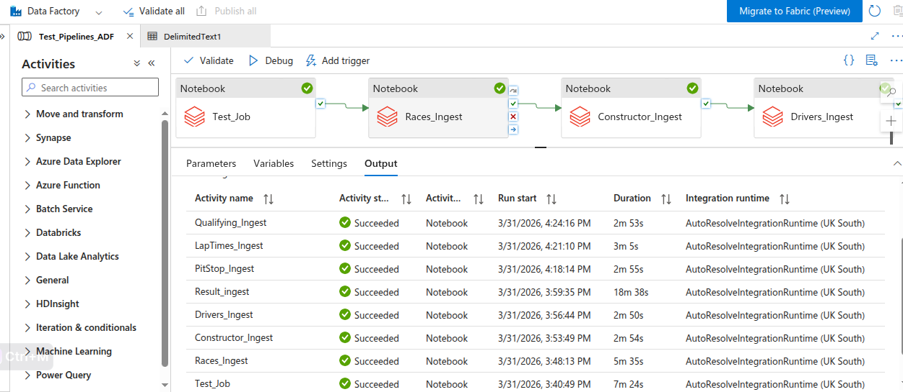

Create Get Metadata to validate Folder
---

We will look into How we can Trigger pipelines if specific folder exists in your dataset.

First, we will create `Get Metadata` - To store your acutal folders as DataSets.

- Choose ADSL Gen 2 and file as JSONs.

- Create `New Linked Service` for this.

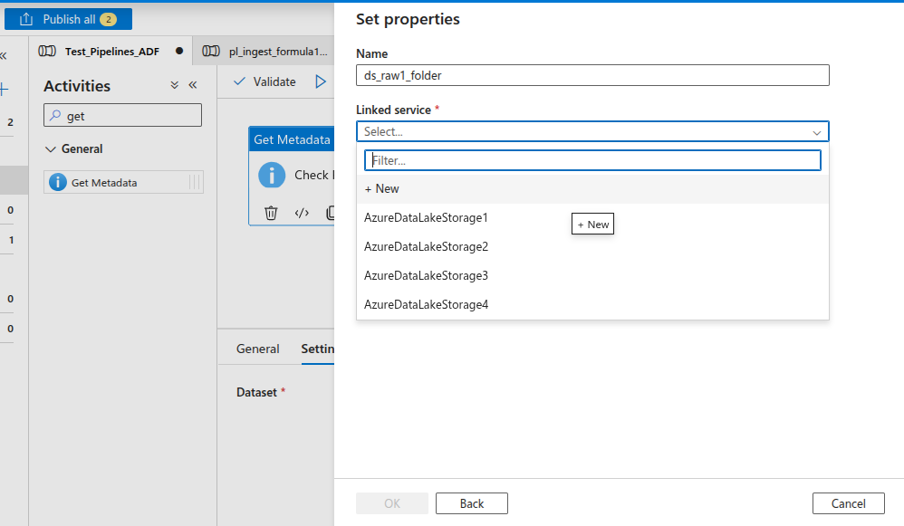

- Create Linked Service to link this Storage Account.

- Choose Access key , Stroage Accounts.

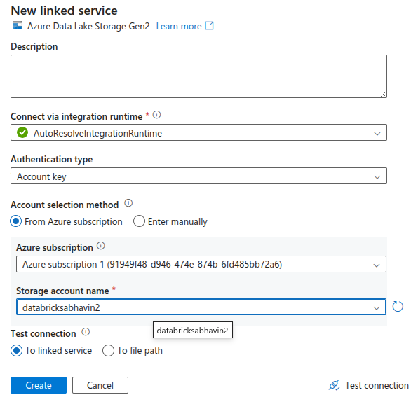

- Choose `linke to service`.

- Now Choose your `raw` container where your acutal folders are there.

- Click on the `Advance Configurations`.

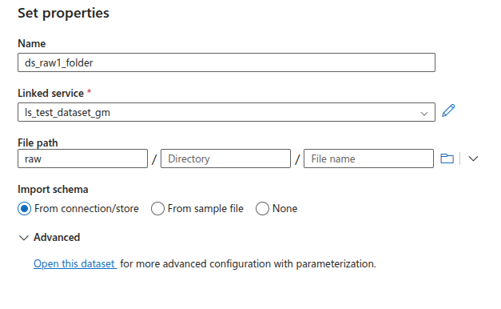

- Now we want to dynamically add all folders name.

- Select Folder/file path > Add Dynamically

- Choose Functions `FormateDateTime`.

- Inside this functions add `Parameter p_window_end_date` and add `, yyyy-MM-dd`.

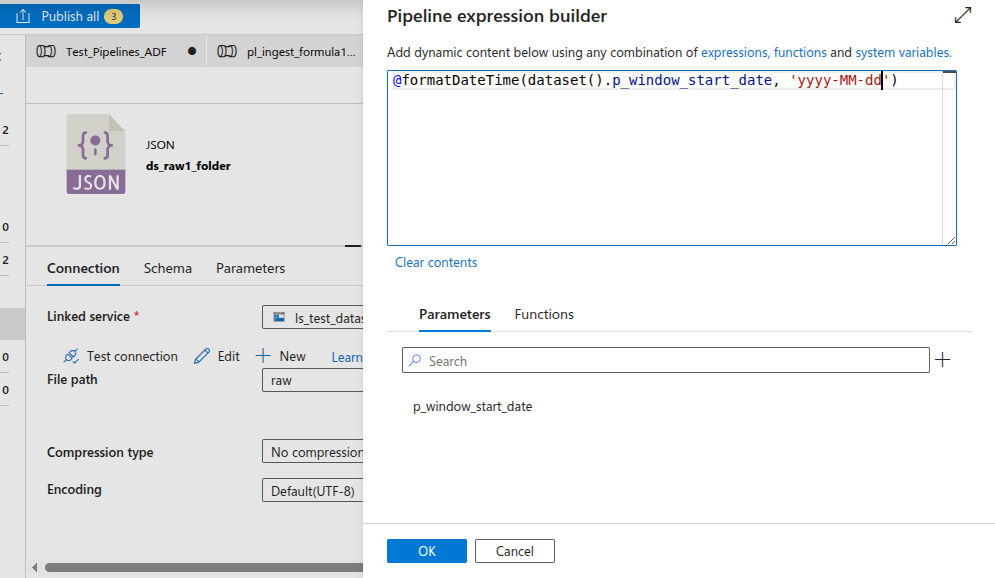

- Come to Get Metadata Activity. In dataset Add dynamic value in pipelines.

- Create Parameter `p_window_end_date`

- Select dataset > click on Add dynamic values

- Choose parameters `p_window_end_date`.

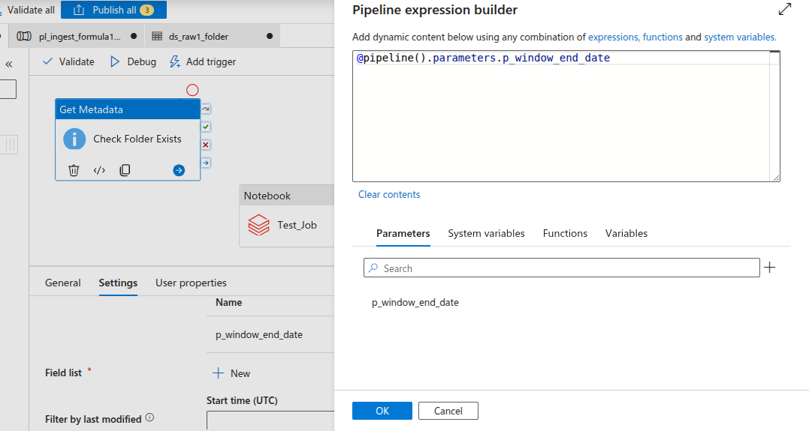

- Now Pipelines can read , list all folders in raw containers. Pipeline will have a all data and informations.

- To make folder availability like `2020-04-02/` make this true , **Add fields `Exists`**.

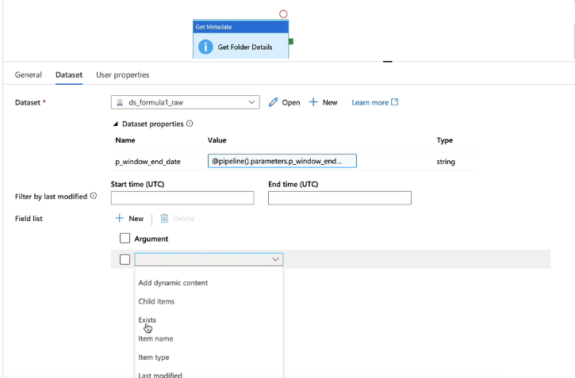

- While Get metadata works and folder is available, we will trigger all pipeline based on condtions `If folder exists = Run all pipelines`.

**Add If else Activity**

Go to Activity - Add Dynamic Activity.

- Choose Get Metadata Acitivity Name `Check Folder Exist`.

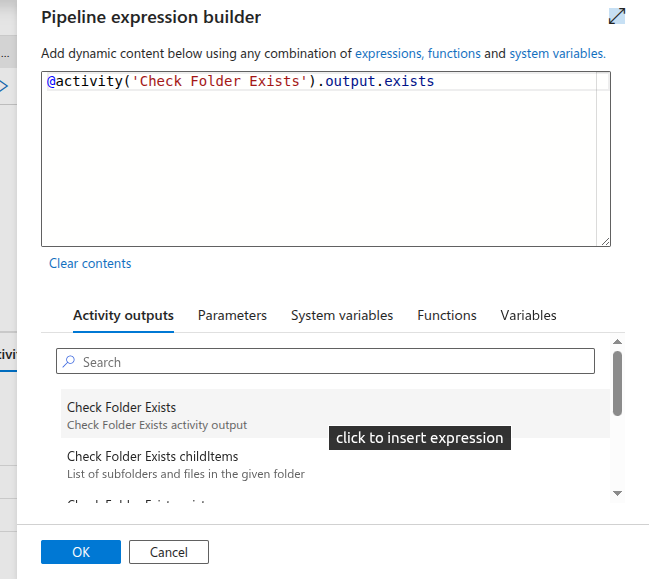

- Now we will Add all this Ingest Activity in our `If Conditions Activity`.

- This will Trigger all Ingest Pipeline if in `raw` container `specific folder exists is true`.

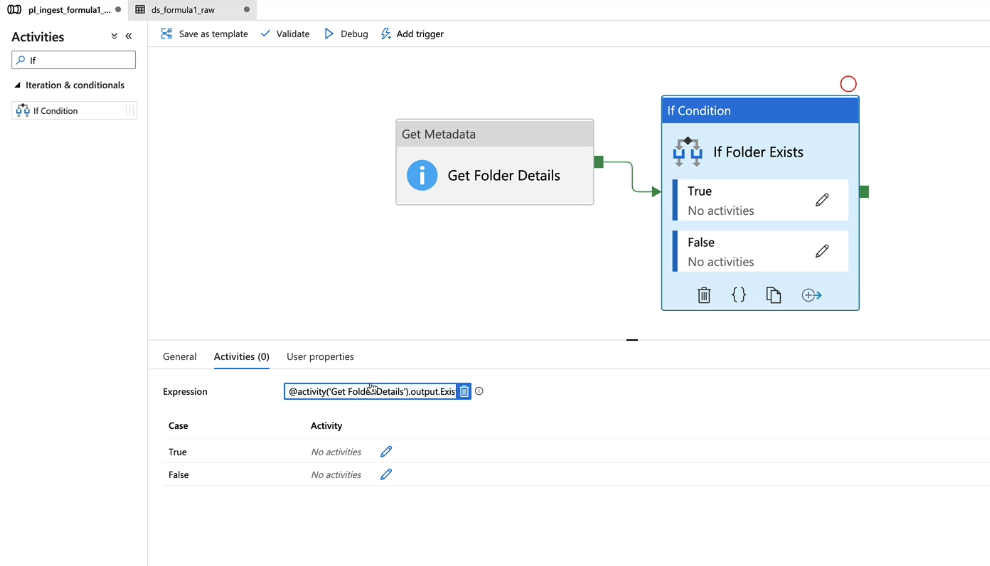

- Click on `True` add all acitivity in it.

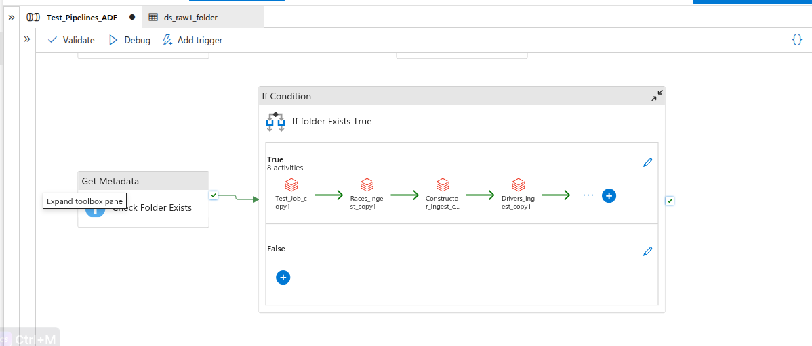

- Debut it and Add Parameter Value `2021-03-04`

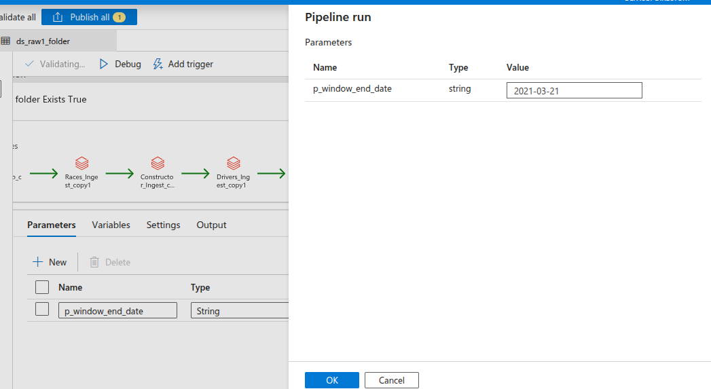

