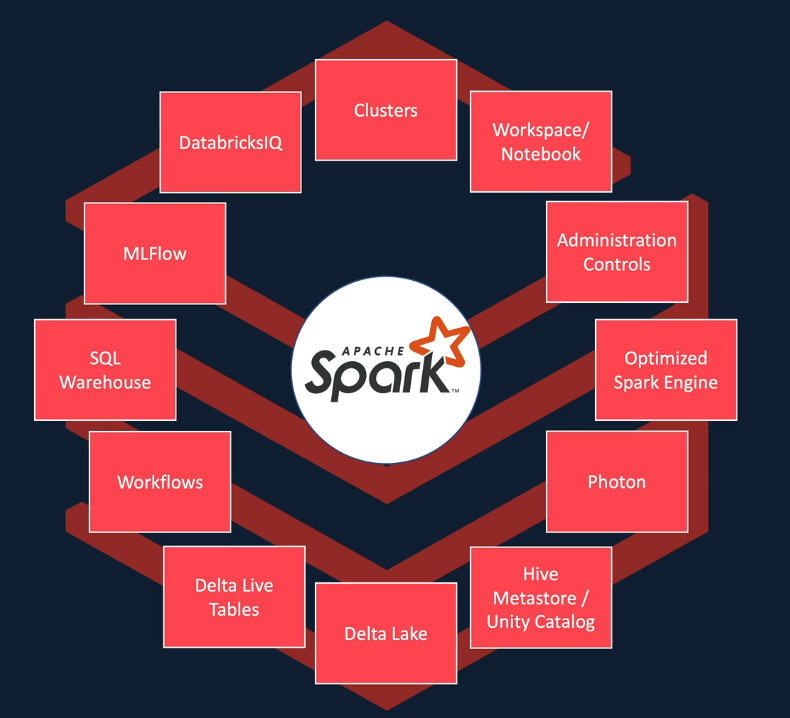
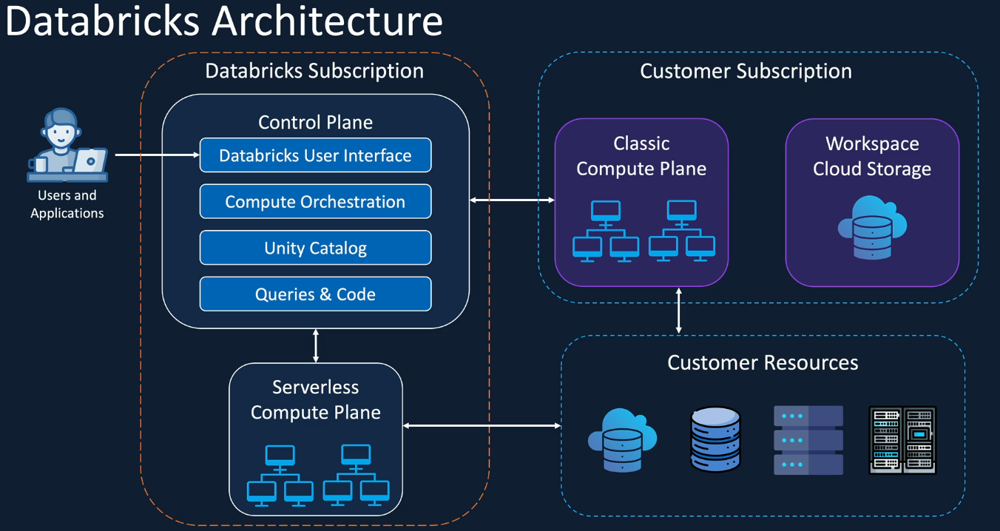

# 🚀 Azure Databricks – Complete Guide (Beginner to Practical)

This document combines **conceptual understanding + architecture + real-world usage** into one structured guide. It is designed for quick revision, interviews, and practical implementation.

---

# 🌌 1. What is Azure Databricks?

Azure Databricks is a **high-performance Apache Spark-based analytics platform** optimized for Microsoft Azure.

It provides a **unified environment** for:

* Data Engineering
* Data Science
* Machine Learning
* Analytics

---

# 🏗️ 2. Core Architecture (Foundation)

At its core, Databricks is built on **Apache Spark**.

### 🔹 Key Concepts

* **Distributed Computing**
  A cluster of machines processes data in parallel instead of a single system.

* **In-Memory Processing**
  Data is processed in RAM → up to **100x faster** than disk-based systems like Hadoop.



# ⚡ 3. Performance Layer (Execution Engines)

These components make your code **extremely fast without changing logic**.

### 🔹 Optimized Spark Engine

* Azure-tuned version of Spark
* Up to **5x faster** than open-source Spark

### 🔹 Photon

* C++ based execution engine
* Uses **vectorized processing**
* Up to **8x faster queries**
* Works best with SQL & DataFrame workloads

👉 Think of Photon as a **turbocharger** for Spark.

---

# 🧠 4. Intelligence & Control Layer

This layer is where you **interact, collaborate, and manage security**.

### 🔹 Workspace / Notebook

* Main working interface
* Supports Python, SQL, Scala, R
* Mix code + text + charts
* Collaborative (like Google Docs)

### 🔹 DatabricksIQ

* Built-in AI assistant
* Helps with:

  * Code generation
  * Debugging
  * Explaining datasets

👉 Think of it as a **Senior Developer beside you**

### 🔹 Administration Controls

* Manage:

  * Users & roles
  * Permissions
  * Cluster access
* Ensures **security & governance**

---

# 🔄 5. Data Pipeline Layer

This layer converts **raw data → clean → usable → AI-ready**.

### 🔹 Delta Live Tables (DLT)

* Simplifies ETL pipelines
* Define output → system handles pipeline
* Automatic:

  * Data quality checks
  * Error handling

### 🔹 Unity Catalog / Hive Metastore

* Central metadata store
* Tracks:

  * Tables
  * Schema
  * Permissions

👉 Think of it as a **Library Index for data**

### 🔹 Clusters

* Group of virtual machines
* Provides compute power

Types:

* Interactive (manual work)
* Job clusters (automated pipelines)

👉 Turn ON when needed, OFF to save cost

# 🧩 6. Key Components Overview

| Component     | Category    | Purpose                    |
| ------------- | ----------- | -------------------------- |
| Apache Spark  | Engine      | Core processing engine     |
| Photon        | Performance | Speeds up queries          |
| Delta Lake    | Storage     | Reliable data layer (ACID) |
| Unity Catalog | Governance  | Data access & tracking     |
| MLflow        | ML          | Experiment tracking        |
| DatabricksIQ  | AI          | Assistant for developers   |
| Clusters      | Compute     | Run workloads              |
| Notebooks     | Interface   | Write and execute code     |

# 🛠️ 7. Why Use Azure Databricks?

### ✅ Key Benefits

1. **High Performance**

   * Up to 5x faster than standard Spark

2. **Collaboration**

   * Shared notebooks
   * Team-friendly environment

3. **Scalability**

   * Auto-scale clusters

4. **Azure Integration**

   * Works with:

     * Azure Data Lake (ADLS)
     * Entra ID (Security)

5. **Cost Optimization**

   * Pay only for compute used

# 🤖 8. AI & Machine Learning Capabilities

Databricks is heavily optimized for ML workflows.

### 🔹 Databricks Runtime for ML

* Pre-installed libraries:

  * PyTorch
  * TensorFlow
  * Scikit-learn

### 🔹 MLflow

* Track experiments
* Compare models
* Version control for ML

### 🔹 Feature Store

* Store reusable ML features

### 🔹 Model Serving

* Deploy models as REST APIs

# 🔁 9. End-to-End Flow (Big Picture)

Example: Stock Price Prediction Project

1. Start a **Cluster**
2. Open a **Notebook**
3. Use **DatabricksIQ** for help
4. Store data in **Delta Lake**
5. Process data using **Spark + Photon**
6. Train model
7. Track results using **MLflow**


---


# 🚀 Azure Databricks Architecture (Control Plane vs Compute Plane)

# 🧠 1. High-Level Architecture

Azure Databricks is divided into **two main parts**:

```
1. Control Plane (Brain 🧠)
2. Compute Plane (Muscle 💪)
```

# 🧩 2. Control Plane (Managed by Databricks)

### 📍 Location

* Runs in **Databricks subscription (not your Azure account)**

### 🎯 Purpose

* Manages platform services, UI, and orchestration

## 🔧 Components

### 🔹 Web UI

* Browser-based interface
* Used to:

  * Create notebooks
  * Run jobs
  * Manage clusters

### 🔹 Cluster Manager

* Responsible for:

  * Creating clusters
  * Scaling clusters
  * Terminating clusters

👉 Acts as a **resource manager**

### 🔹 Unity Catalog

* Provides:

  * Data governance
  * Access control
  * Permissions management

👉 Think of it as **RBAC for data**

### 🔹 Workspace Metadata Storage

Stores:

* Notebooks
* Job history
* Logs

⚠️ Note: This does NOT store large datasets (only metadata)

# 💪 3. Compute Plane (Your Azure Subscription)

### 📍 Location

* Runs in **your Azure subscription**

### 🎯 Purpose

* Executes actual data processing tasks

## 🔥 Types of Compute

### 🟡 1. Classic Compute

#### ✔️ Description

* Clusters (VMs) are created inside your Azure account

#### ✔️ Features

* Full control over:

  * VM size
  * Cluster configuration
  * Scaling

#### ✔️ Use Cases

* Data engineering workloads
* ADF integration
* Course labs and projects

#### 📌 Flow

```
User → UI → Cluster Manager → Creates VMs in YOUR Azure
```

### 🟢 2. Serverless Compute

#### ✔️ Description

* Runs in Databricks-managed infrastructure

#### ✔️ Features

* Faster startup (pre-provisioned VMs)
* No cluster management

#### ❌ Limitations

* Less control
* Not ideal for full data engineering workflows

# 💾 4. Workspace Storage (ADLS Gen2)

### 📍 Location

* Created in **your Azure subscription**

### 🔹 Used For

* Notebook revisions
* Job run details
* Spark logs
* Temporary data

⚠️ Important:

* Tied to workspace
* Deleted if workspace is deleted

# 🎯 5. End-to-End Flow

When you run a notebook:

1. User opens notebook in Web UI
2. Request goes to Control Plane
3. Cluster Manager checks cluster
4. If not running → creates cluster in your Azure
5. Code executes on compute (VMs)
6. Data is read from ADLS
7. Results are returned to UI

---

# 📊 6. Architecture Diagram (Logical View)



# ⚠️ 7. Common Confusions

| Component          | Location                   |
| ------------------ | -------------------------- |
| Web UI             | Databricks (Control Plane) |
| Cluster (VMs)      | Your Azure (Compute Plane) |
| Data Storage       | Your Azure (ADLS)          |
| Serverless Compute | Databricks                 |

