# 🚀 Azure Databricks – Complete Guide (Beginner to Practical)

This document combines **conceptual understanding + architecture + real-world usage** into one structured guide. It is designed for quick revision, interviews, and practical implementation.

---

# 🌌 1. What is Azure Databricks?

Azure Databricks is a **high-performance Apache Spark-based analytics platform** optimized for Microsoft Azure.

It provides a **unified environment** for:

* Data Engineering
* Data Science
* Machine Learning
* Analytics

---

# 🏗️ 2. Core Architecture (Foundation)

At its core, Databricks is built on **Apache Spark**.

### 🔹 Key Concepts

* **Distributed Computing**
  A cluster of machines processes data in parallel instead of a single system.

* **In-Memory Processing**
  Data is processed in RAM → up to **100x faster** than disk-based systems like Hadoop.


# ⚡ 3. Performance Layer (Execution Engines)

These components make your code **extremely fast without changing logic**.

### 🔹 Optimized Spark Engine

* Azure-tuned version of Spark
* Up to **5x faster** than open-source Spark

### 🔹 Photon

* C++ based execution engine
* Uses **vectorized processing**
* Up to **8x faster queries**
* Works best with SQL & DataFrame workloads

👉 Think of Photon as a **turbocharger** for Spark.

---

# 🧠 4. Intelligence & Control Layer

This layer is where you **interact, collaborate, and manage security**.

### 🔹 Workspace / Notebook

* Main working interface
* Supports Python, SQL, Scala, R
* Mix code + text + charts
* Collaborative (like Google Docs)

### 🔹 DatabricksIQ

* Built-in AI assistant
* Helps with:

  * Code generation
  * Debugging
  * Explaining datasets

👉 Think of it as a **Senior Developer beside you**

### 🔹 Administration Controls

* Manage:

  * Users & roles
  * Permissions
  * Cluster access
* Ensures **security & governance**

---

# 🔄 5. Data Pipeline Layer

This layer converts **raw data → clean → usable → AI-ready**.

### 🔹 Delta Live Tables (DLT)

* Simplifies ETL pipelines
* Define output → system handles pipeline
* Automatic:

  * Data quality checks
  * Error handling

### 🔹 Unity Catalog / Hive Metastore

* Central metadata store
* Tracks:

  * Tables
  * Schema
  * Permissions

👉 Think of it as a **Library Index for data**

### 🔹 Clusters

* Group of virtual machines
* Provides compute power

Types:

* Interactive (manual work)
* Job clusters (automated pipelines)

👉 Turn ON when needed, OFF to save cost

# 🧩 6. Key Components Overview

| Component     | Category    | Purpose                    |
| ------------- | ----------- | -------------------------- |
| Apache Spark  | Engine      | Core processing engine     |
| Photon        | Performance | Speeds up queries          |
| Delta Lake    | Storage     | Reliable data layer (ACID) |
| Unity Catalog | Governance  | Data access & tracking     |
| MLflow        | ML          | Experiment tracking        |
| DatabricksIQ  | AI          | Assistant for developers   |
| Clusters      | Compute     | Run workloads              |
| Notebooks     | Interface   | Write and execute code     |

# 🛠️ 7. Why Use Azure Databricks?

### ✅ Key Benefits

1. **High Performance**

   * Up to 5x faster than standard Spark

2. **Collaboration**

   * Shared notebooks
   * Team-friendly environment

3. **Scalability**

   * Auto-scale clusters

4. **Azure Integration**

   * Works with:

     * Azure Data Lake (ADLS)
     * Entra ID (Security)

5. **Cost Optimization**

   * Pay only for compute used

# 🤖 8. AI & Machine Learning Capabilities

Databricks is heavily optimized for ML workflows.

### 🔹 Databricks Runtime for ML

* Pre-installed libraries:

  * PyTorch
  * TensorFlow
  * Scikit-learn

### 🔹 MLflow

* Track experiments
* Compare models
* Version control for ML

### 🔹 Feature Store

* Store reusable ML features

### 🔹 Model Serving

* Deploy models as REST APIs

# 🔁 9. End-to-End Flow (Big Picture)

Example: Stock Price Prediction Project

1. Start a **Cluster**
2. Open a **Notebook**
3. Use **DatabricksIQ** for help
4. Store data in **Delta Lake**
5. Process data using **Spark + Photon**
6. Train model
7. Track results using **MLflow**


---


# 🚀 Azure Databricks Architecture (Control Plane vs Compute Plane)

# 🧠 1. High-Level Architecture

Azure Databricks is divided into **two main parts**:

```
1. Control Plane (Brain 🧠)
2. Compute Plane (Muscle 💪)
```

# 🧩 2. Control Plane (Managed by Databricks)

### 📍 Location

* Runs in **Databricks subscription (not your Azure account)**

### 🎯 Purpose

* Manages platform services, UI, and orchestration

## 🔧 Components

### 🔹 Web UI

* Browser-based interface
* Used to:

  * Create notebooks
  * Run jobs
  * Manage clusters

### 🔹 Cluster Manager

* Responsible for:

  * Creating clusters
  * Scaling clusters
  * Terminating clusters

👉 Acts as a **resource manager**

### 🔹 Unity Catalog

* Provides:

  * Data governance
  * Access control
  * Permissions management

👉 Think of it as **RBAC for data**

### 🔹 Workspace Metadata Storage

Stores:

* Notebooks
* Job history
* Logs

⚠️ Note: This does NOT store large datasets (only metadata)

# 💪 3. Compute Plane (Your Azure Subscription)

### 📍 Location

* Runs in **your Azure subscription**

### 🎯 Purpose

* Executes actual data processing tasks

## 🔥 Types of Compute

### 🟡 1. Classic Compute

#### ✔️ Description

* Clusters (VMs) are created inside your Azure account

#### ✔️ Features

* Full control over:

  * VM size
  * Cluster configuration
  * Scaling

#### ✔️ Use Cases

* Data engineering workloads
* ADF integration
* Course labs and projects

#### 📌 Flow

```
User → UI → Cluster Manager → Creates VMs in YOUR Azure
```

### 🟢 2. Serverless Compute

#### ✔️ Description

* Runs in Databricks-managed infrastructure

#### ✔️ Features

* Faster startup (pre-provisioned VMs)
* No cluster management

#### ❌ Limitations

* Less control
* Not ideal for full data engineering workflows

# 💾 4. Workspace Storage (ADLS Gen2)

### 📍 Location

* Created in **your Azure subscription**

### 🔹 Used For

* Notebook revisions
* Job run details
* Spark logs
* Temporary data

⚠️ Important:

* Tied to workspace
* Deleted if workspace is deleted

# 🎯 5. End-to-End Flow

When you run a notebook:

1. User opens notebook in Web UI
2. Request goes to Control Plane
3. Cluster Manager checks cluster
4. If not running → creates cluster in your Azure
5. Code executes on compute (VMs)
6. Data is read from ADLS
7. Results are returned to UI

---

# 📊 6. Architecture Diagram (Logical View)


# ⚠️ 7. Common Confusions

| Component          | Location                   |
| ------------------ | -------------------------- |
| Web UI             | Databricks (Control Plane) |
| Cluster (VMs)      | Your Azure (Compute Plane) |
| Data Storage       | Your Azure (ADLS)          |
| Serverless Compute | Databricks                 |


---

# 🚀 Azure Databricks Clusters – Learning Guide

This README is a **pre-learning guide** to help you clearly understand what you will learn in the upcoming section about **Databricks Clusters**.

---

# 🎯 What You Will Learn

In this section, you will build a **strong foundation around Databricks Clusters**, which are the core compute resources used to run your data workloads.

By the end, you will be able to:

* Understand what a cluster is
* Choose the right cluster type
* Configure clusters correctly
* Control and estimate costs
* Use advanced features like cluster pools and policies

# 🧠 1. What is a Databricks Cluster?

A **Databricks Cluster** is a group of virtual machines (VMs) that work together to:

* Run Spark jobs
* Process data
* Execute notebooks

👉 Think of it as the **engine that runs your code**.

# 🔥 2. Types of Clusters

You will learn about the two main types:

### 🟡 All-Purpose Cluster

* Used for:

  * Development
  * Interactive work (notebooks)
* Shared by multiple users

### 🟢 Job Cluster

* Used for:

  * Automated jobs
  * Pipelines
* Created and deleted automatically

👉 Key difference: **Interactive vs Automated usage**

# ⚙️ 3. Cluster Configuration (Very Important)

You will explore how to configure clusters based on workload.

### 🔹 Key Configurations:

* Node type (VM size)
* Number of workers
* Auto-scaling
* Runtime version (Spark version)
* Access mode
* Auto-termination

👉 You will also learn:

* How to choose **right config for performance + cost**

# 🛠️ 4. Hands-On: Creating a Cluster

You will:

* Create a cluster for your project
* Configure it based on requirements
* Run workloads on it

👉 This is where theory becomes practical

# 💸 5. Cluster Pricing (Critical Topic)

Databricks pricing includes:

* **DBU (Databricks Units)** → Platform cost
* **VM Cost (Azure)** → Compute cost

👉 Total Cost = DBU + VM

You will learn:

* How pricing works
* Why cost can increase quickly

# 💡 6. Cost Optimization (Must Know)

You will learn how to:

* Use auto-termination
* Select smaller clusters
* Avoid idle clusters
* Estimate cost for your project

👉 This is **very important for real-world + org accounts**

# ⚡ 7. Cluster Pools (Advanced – Optional)

### 🔹 What are Cluster Pools?

* Pre-created VMs
* Reduce cluster startup time

### 🔹 Benefits:

* Faster cluster creation
* Better resource management

👉 Used mostly by admins, but important to understand

# 🛡️ 8. Cluster Policies (Advanced – Optional)

### 🔹 What are Cluster Policies?

* Rules that control how clusters are created

### 🔹 Benefits:

* Enforce best practices
* Limit cost usage
* Improve user experience

👉 Example:

* Restrict large VM usage
* Force auto-termination

---

In databricks, compute refers to a cluster of vm.

In a cluster, there is a `Driver Node` that orchestrates the tasks and *One or More Worker Nodes** that perform the actual data processing like `ETL` Together.


- These nodes allow databricks clusters tor run various workloads such as `ETL`, `Data science tasks` and `Machine Learning Apps`.


- Databricks offers 2 types of computes, 
 
1. Serverless compute plane
2. Classic compute plane

`Serverless Compute` is available on demand and managed by Databricks, whereas the `Classic Compute` is configured and provisions by the user.

`Serverless Compute` is a fully managed service which databricks provisions and manages and compute resources are provisions in databricks cloud account.

Databricks keeps a pool of VM available for the cluster, so the cluster starts immediatly.

Datarbricks configures the cluster with the latest runtime available and scales the cluster up and down using the intelligence from AI models.

Once the task completes, Databricks automatically release the resources back to the pool and customers will only charged for the durations of the cluster was up and running.

`Classic Compute` is totally controlled by the user.
We nned to configure and manage the cluster, and we have total control over 

  - which version of the software to use, 
  - what kind of compute nodes we want to create the cluster with, 
  - How many nodes we want to allocate and 
  - the size of them VM etc

**Classic Compute Types**

**1. All Purpose**

- Created manually via GUI, CLI or API

- This cluster are persistance and they can be terminated and restarted at any point in time.

- Suitable for `Interactive` and `ad hoc analytical workloads`.

- Can be **Shared with many users** and They are good for collaborative analysis.

- More Expensive compaire to the Job Cluster.

**2. Job Cluster**

- Will created while automated job starts to execute and the job has been configured to use a job cluster

- Job clusters are terminated at the end of the job.
- They can't be restarted, so they are no longer usable once the job has completed.

- Suitable for `Automated workloads` such as Running an ETL pipeline or ML Workload.

- Are Isolated just for the job being executed.

- Cheaper to execute.


## Cluster COnfigurations

**1. Multi-Node Cluster**

- One Driver node (the boss) and one or more Worker nodes (the laborers).

- **Use case**: Production-level work or huge datasets.

- **Power**: The Driver splits up the work and sends it to Workers to run in parallel.


**2. Single Node Cluster**

- There is only single **Driver Node** and **No any of Worker Node there**.
- There is a lack of worker node.
- Still it supports spark workloads and the same node acts as both Driver/Master and Worker nodes.

- It Can't be act Horizontally scaled, making it unsuitable for large scale ETL workloads.

- Single node clusters are desinged for `lightweight machine learning ` and `data analysis tasks` that don't required distributed computing.

- Single node clusters are Incompatible with process isolations and are not intended for shared usage among multiple users or workloads.

- To avoid these kind of conflicts, databricks always recommends using `multi-node clusters` when `shared compute is required`.

**Access Mode (Security)**

- This determines who is allowed to "sit in the driver's seat" and how much they can see.

| Mode | Users | Key Feature |
| ---- | ----- | ----------- |
| Single User | 1 Person | "Supports Python, SQL, Scala, and R." |
| Shared | Multiple | Process Isolation: Users can't peek at each other's data or code. Highly secure. |
| No Isolation | Multiple | "No ""walls"" between users. If one user crashes the system, everyone feels it." |

**Runtime (The Brain's Software)**

- The "Runtime" is the set of libraries pre-installed on the cluster.

- **Databricks Runtime**: Standard libraries for data engineering and SQL.

- **Databricks Runtime ML**: The "Scientist" version. It comes pre-loaded with PyTorch, TensorFlow, and XGBoost.

- **Photon Acceleration**: A toggle switch to make queries run up to 8x faster by using a specialized C++ engine.


**Configure Cost Controls (Saving Money)**

- Azure charges you for every minute the cluster is "on," so these settings are critical:

- **Auto-Termination**: Set a timer (e.g., 20 minutes). If no one is using the cluster, it automatically turns off.

- **Auto-Scaling**: You give Databricks a range (e.g., 2 to 10 workers). It will add workers when the job is hard and remove them when it's easy.

- **Spot Instances**: Use Azure’s "spare" computers for worker nodes. They are much cheaper but can be taken back by Azure if someone else pays full price.


**Pick the Hardware (VM Types)**
**Auto Scaling**

- Different tasks require different types of virtual machines (VMs).

  - **Memory Optimized**: For caching huge datasets or complex joins.

  - **Compute Optimized**: For high-speed streaming data.

  - **Storage Optimized**: For tasks that need to read/write to the disk constantly.

  - **GPU Accelerated**: Specifically for deep learning and heavy AI training.

  - **General Purpose**: A balanced middle-ground for most daily tasks.


**Apply Policies (The Guardrails)**

- If you are an administrator, you don't want your team accidentally spending $1,000 in a day. Cluster Policies allow you to:

  - Limit the size of the clusters users can create.

  - Force Auto-Termination to stay at a low number.

  - Lock the Runtime version so everyone uses the same tools.


Create Databick Cluster
---

Go to Databircks > Computes > Create computes

Turn Off - Simple Form, You will configured manually whole things

Choose Policy Unrestricted

Choose Single Node

Choose Access Mode as `Dedicated` for single user for testing and select `Your name` as single user.

Select Performance Databricks runtime versions - LTS

Unselect `Use photon accelerations`.

Select Node typs - General Purpose which is smallest size for testing

Tick box `Terminates after 120 minutes of inactivity` to help to auto delete cluster if no activity detect


Cluster Pool
---

# 🚀 Azure Databricks Cluster Pools – Complete Guide

This README is your **master reference** for understanding Azure Databricks **Cluster Pools** and how to balance **performance ⚡ and cost 💸**.

# ☕ The Coffee Shop Analogy

To understand Cluster Pools, imagine a coffee shop:

### 🟡 Without Pool (Standard Cluster)

* Machine is OFF
* Beans not ready
* Setup takes time

⏱️ Wait Time: **5–10 minutes**

### 🟢 With Cluster Pool

* Machine already ON
* Beans already prepared

⏱️ Wait Time: **~1 minute**

👉 **Conclusion:** Pools reduce cluster startup time significantly

# ⚙️ How Cluster Pools Work

A Cluster Pool is a **collection of pre-started Virtual Machines (VMs)** ready to be used.

### 🔄 Flow

1. Pool keeps some VMs in idle (ready state)
2. When cluster starts → it takes VM from pool
3. If more power needed → more VMs pulled instantly
4. Pool replaces used VMs to maintain minimum level

# 📋 Key Configuration Settings

| Setting            | Meaning                    | Importance                        |
| ------------------ | -------------------------- | --------------------------------- |
| Min Idle Instances | Minimum always-running VMs | Faster startup but costs money 💸 |
| Max Capacity       | Maximum VMs allowed        | Controls scaling                  |
| Preloaded Runtime  | Pre-installed software     | Faster startup                    |
| Auto-Termination   | Idle VM shutdown timer     | Saves cost                        |

# 💰 Cost Model (VERY IMPORTANT)

Cluster Pools have **two types of cost**:

| Cost Type     | Idle VMs (Pool) | Active Cluster VMs |
| ------------- | --------------- | ------------------ |
| Azure VM Cost | 💰 YES          | 💰 YES             |
| DBU Cost      | ✅ FREE          | 💰 YES             |

## ⚠️ Important Warning

👉 If **Min Idle = 1**

* That VM runs 24/7
* You are charged continuously

# ⚖️ Trade-Off: Speed vs Cost

| Priority     | Recommendation    |
| ------------ | ----------------- |
| Fast startup | Increase Min Idle |
| Low cost     | Set Min Idle = 0  |

👉 You must balance both

# 🎓 Recommended Setup (For Students / Budget Users)

Use this configuration to get **best balance**:

```
Min Idle Instances        → 0
Max Capacity              → 2 or 3
Auto-Termination (Idle)   → 30–60 mins
Preloaded Runtime         → Enabled
```

## ✅ Benefits of This Setup

* 💸 Zero cost when not in use
* ⚡ Faster restart within short time
* 🔄 Automatic scaling within limits

# 🧠 Real Usage Scenario

1. Start cluster → VM taken from pool
2. Finish work → cluster stopped
3. VM stays warm for 30–60 mins
4. Restart quickly if needed
5. Auto shuts down if unused

# ⚠️ Common Mistakes

❌ Setting Min Idle > 0 unnecessarily
❌ High Max Capacity → unexpected cost
❌ Forgetting auto-termination

# 🎯 When to Use Cluster Pools

Use Pools when:

* Frequent cluster start/stop
* Need faster startup
* Team/shared environments

Avoid Pools when:

* Rare usage
* Strict budget constraints

# 🧠 Key Takeaway

👉 **Cluster Pool = Faster Start ⚡ but potential cost 💸**


DataBricks Cluster Policy
---


# Databricks Cluster Policies Guide

## 📖 Overview

Cluster Policies are a set of rules used by administrators to limit the configuration options available to users when they create clusters. Think of them as "Guardrails" that ensure users create clusters that are cost-effective, secure, and standardized.

## ❓ The Problem: Why do we need Policies?

Creating a cluster in Databricks manually is complex. Without a policy, a user might:

* Accidentally incur high costs: Selecting a massive machine (node) for a small task.
* Waste Resources: Forgetting to turn on "Auto-Termination," leaving a cluster running (and billing) overnight.
* Configuration Errors: Choosing a Databricks Runtime version that is incompatible with the team's code.
* Security Risks: Misconfiguring access or network settings.

## ✅ The Solution: What Policies Do

Policies act as a template or a filter for the Cluster Creation UI. They provide four main functions:

| Function     | Description                                                                                     |
| ------------ | ----------------------------------------------------------------------------------------------- |
| Hide Options | Removes complex or unnecessary settings from the UI to make it simpler for beginners.           |
| Fix Values   | Hardcodes specific settings (e.g., "The Runtime must be 13.3") so the user cannot change them.  |
| Set Defaults | Pre-fills fields with recommended values (e.g., "Auto-terminate after 20 minutes").             |
| Limit Ranges | Restricts choices to a specific set (e.g., "User can only pick nodes with 8GB to 32GB of RAM"). |

## 🛠️ How it Works (The Workflow)

1. **Admin Creation**: An administrator defines the policy using a JSON-based set of rules.
2. **Permission Assignment**: The admin grants "Use" permission to specific users or groups.
3. **User Selection**: When a user clicks "Create Cluster", they see a Policy Dropdown.
4. **Simplified UI**: Once a policy is selected, the UI dynamically updates to show only the allowed options.

## 💰 Requirements & Cost

* **Premium Tier Only**: Cluster policies are only available for Databricks workspaces created in the Premium Tier.
* **Governance Tool**: They are primarily used for "Governance"—balancing the freedom of the user to do their work with the company's need to control the cloud bill.

## 💡 Key Takeaways for Beginners

* **Empowerment**: Policies allow standard users to create their own clusters without needing an admin to approve every single request.
* **Standardization**: Every cluster created under a "Data Science Policy" will look and act the same, making it easier to share code and collaborate.
* **Safety Net**: You don't have to worry about "breaking" the budget; the policy won't let you pick an option that is too expensive.


## Hands-On Practices

- Go to Databricks > compute > Policies


- Here default 4 policies are created by databricks.

- You can also create a new cluster policy as per your requirement.

**Requirement of Cluster Policy**

1. Policy - Unrestricted
2. Single Node Cluster
3. Databrick Runtime Version - Latest - LTS 17.3 (Scala 2.13, Spark 4.0.0)
4. Node Type 
  
  - General Purpose - Standard_DS3-v2
  - General Purpose HDD - Standard_D3_V2

5. Terminate after 20 minutes of inactivity.


- Create Cluster Policy > Name of policy > Family select - Custome

- Write Definitions

```json

// {
//   "spark_version": { 
//     "type": "fixed", 
//     "value": "auto:latest-lts", "hidden": true 
//     }
// }

{
  "spark_conf.spark.databricks.cluster.profile": {
    "type": "fixed",
    "value": "singleNode",
    "hidden": true
  },

  "driver_node_type_id": {
    "type": "allowlist",
    "values": [
      "Standard_DS3_v2",
      "Standard_D3_v2"
    ],
    "defaultValue": "Standard_DS3_v2"
  },

  "autotermination_minutes": {
    "type": "fixed",
    "value": 20
  },

  "spark_version": { 
  "type": "fixed", 
  "value": "auto:latest-lts", "hidden": true 
  },

  "cluster_type": {
    "type": "fixed",
    "value": "all-purpose"
  }
}
```

- Create it

- Try to Create Compute Resource > Select this policy

- It will populate all settings into your compute.


Notebook Intro
---

Go to Workspace > Users > Create folder > Create Notebook.

- To use notebook We will required to attach notebook to our Compute Cluster.

- Create cluster.
- Connect Notbook to this cluster by click on connect on top or right.

- Default language is Pythons.
- You can choose Other language in any of your cell of notebooks.


Magic Commands
---

They allow you to switch languages, manage files, or install libraries without leaving your current cell.

Magic commands always start with a percent sign:

**Line Magics (%)**: Apply only to a single line of code.

**Cell Magics (%%)**: Apply to the entire cell. (Note: In Databricks, most commands use a single % even for the whole cell).

| Command | Purpose | Example |
| ------- | ------- | ------- |
| %md | "Renders Markdown (text, headings, lists) for documentation. | ",%md # My Analysis |
| %sql | Runs SQL code inside a Python or Scala notebook. | %sql SELECT * FROM users |
| %python | Switches the cell language to Python. | "%python print(""Hello"")" |
| %pip | Installs libraries directly to your cluster. | %pip install pandas |
| %run | Executes another notebook and imports its functions. | %run ./Shared/CommonUtils |
| %fs | Accesses the Databricks File System (to see files). | %fs ls /databricks-datasets |

```bash
%sh # for Shell 
ps 
```


```bash
%fs /
```


- Install Python Lib

```bash
%pip install faker
```


- Import Another notebook into current notebook.

- Create `2.1 Env Vars` Notebook and paste this content for testing


```python
import os
import platform

def print_evn_info():
  print(f"Python Version: {platform.python_version()}")

  runtime_version = os.environ.get("DATABRICKS_RUNTIME_VERSION", "Unknown")

  print(f"Databricks Runtime Version: {runtime_version}")

```

- Copy Full Path of this notebook and come back to notebook where you want to copy

```bash
%run "Your Full Path URL of 2.1 Notebook"
```

Databricks Utilities
---

- Databricks utilities make it easier to combine diff types of tasks in a single notebook.

- They allow us to combine `File Ops` with `ETL` tasks.

- They are great for quick tasks, dbutils allows you to perform those same tasks like magic commands inside your actual code (Python or Scala) using variables and logic.

- They can't be run from a SQL cell.

  **1. File System Utilities**
  - Allow us to access Databricks File system from a notebook, and you can use various File Ops

  **2. Secrets Utilities**
  - Secrets utilities allow you to pull sensitive information from a "Vault" (Azure Key Vault).

  **3. Widget Utilities**

  - Widgets are interactive components like dropdowns, text boxes, or checkboxes that appear at the top of your notebook.

  - They allow you to parameterize your code.

  - Scenario: You build one notebook to clean data, and use a widget so the user can select which "Month" or "Region" to clean without changing the code.

**Hands-On Practices**

- We will use `dbutils` instead of magic commands %fs /

- dbutils.magic_commnads_flag.Your_commands('File_Path')


```bash
dbutils.fs.ls('/')
```


- To print in a tabular formate, use **display**

```bash
display(dbutils.fs.ls('/'))
```


### What is difference between Magic Commands and dbutils ?

- **Magic Commands** is usefull for quick ad hoc file system queries

- **dbutils** is useful for Programmatic tasks.

- Lets save dbutils command in a variables `items` and use in python code.

```python
items = dbutils.fs.ls('/databricks-datasets/')

folder_count = len([item for item in items if item.name.endswith("/")])

file_count = len([item for item in items if not item.name.endswith("/")])

print(f"Total Folders: {folder_count}")

print(f"Total Files: {file_count}")
```


Import DBC files
---

Databricks allows us to import files and workspace from your pc to databricks.

- Go to Notebook/workspace 
- Look for Import and click it
- It will ask for file and URL.
- If you have files on your pc select files or URL
- Once Import it will look like this


Access Azure Data Lake Storage
---

- Databricks uses Azure Data Lake Storage Gen2 for Storage Sol.

- We can authenticate this storage by multiple way
  
  - 1. Storage Access Keys
  - 2. Shared Access Stignrature SAS Token - For Granual level access
  - 3. Service Principle
    
    - We can create Service Principle and give the required access for the data lake to the service principle.


We have 2 scope level to authenticate Storage sols by using credentials.

**1. Session Scoped Authentications**

- We will use these creds in the notebook and authenticate to the data lake.

- Authentication will valid untill notebook has benn detached from cluster.

**2. Cluster Scoped Authentications**

- Use these creds in the cluster and authenticate form the cluster

- Authentication will happens when the cluster starts and it will valid until the cluster has been terminated.

- All the notebooks connected to this cluster will have access to the data.

**3. Azure Active Directory Authentications**

- We just need to enabled the cluster to use Azure AD Pass through authentications.

- Whenever a user runs a notebook,  the cluster will use the user's Azure AD creds and look for the role that user's has been assigned to the Azure Data Lake Storage using IAM 

- If the user has access to the storage account , it will allow to access the storage account.


- **Azure AD Authentications is only available on Premium workspace**.

**4. Unity Catelog**

- Administrator can define the access permissions for a user using the Databricks Unity Catelog.

- Whenever user trying to access the storage account, the cluster will check for the user's access in the `Unity Catelog`.

- If the user has the required permissions, it will allow the user to acess the storage account.

- **Unity Catelog Authentications is only available on Premium workspace**.


Access Azure Storage Data Lake to Databricks
---


## 1. Access Keys (The "Master Keys")
When you create an Azure Storage Account, Azure gives you two **Access Keys**. 

* **Total Power:** Having this key is like being the "Owner." Someone with this key can read, delete, or change anything in your storage.

* **Security Warning:** As a beginner, it is okay to paste these in your code for practice, but in a real job, you **must** hide them in an **Azure Key Vault** so people can't see them in your notebooks.

## 2. The Spark Configuration (The "Handshake")
To make the connection, you have to tell Spark (the engine behind Databricks) which key to use for which storage account. You do this with a specific configuration line in your notebook.

**The formula looks like this:**
`spark.conf.set("fs.azure.account.key.<storage-account-name>.dfs.core.windows.net", "<your-512-bit-key>")`

* **`fs.azure.account.key`**: This tells Spark, "I am giving you a key."
* **`<storage-account-name>.dfs.core.windows.net`**: This is the "Endpoint." It tells Spark exactly which storage account the key belongs to.

## 3. The ABFS Driver (The "Language")
In the past, people used `http://` to find files. But for Big Data, Microsoft created a special "driver" called **ABFS** (Azure Blob File System). It is much faster and more secure for moving massive amounts of data.

To find a file using this driver, you use a special **URI (Unique Resource Identifier)**.


### Breaking down the URI:
The address follows this exact pattern:
**`abfss://<container-name>@<storage-account-name>.dfs.core.windows.net/<folder-path>/<file-name>`**

* **`abfss`**: The "s" at the end stands for **Secure**. It ensures your data is encrypted while it travels between Azure and Databricks. Always use the "s"!
* **`@`**: This separates the container name from the storage account name.
* **`.dfs.`**: Remember our previous talk about the "Hierarchical Namespace"? The "dfs" part is what tells Azure you are using the Data Lake features (folders), not just standard blob storage.

## 💻 Practice Example
If you have a container named `raw-data` and a storage account named `mystudydata`, your code to list the files would look like this:

```python
# 1. Set the configuration (The Handshake)
spark.conf.set(
    "fs.azure.account.key.mystudydata.dfs.core.windows.net", 
    "PASTE_YOUR_LONG_512_BIT_KEY_HERE"
)

# 2. Define the path (The Address)
my_path = "abfss://raw-data@mystudydata.dfs.core.windows.net/"

# 3. Use Databricks Utilities to see the files
display(dbutils.fs.ls(my_path))
```

### Summary for Beginners:
1.  **Get the Key** from the Azure Portal (Access Keys tab).
2.  **Set the Config** in your first notebook cell.
3.  **Use the `abfss` path** to read your data.


**Hands-On Practices**

## Authenicate by using SA Access Key

- Create Storage Account.
- Create containers 
  - raw,
  - processed,
  - presentations,
  - demo

- Upload `circuits.csv` in demo containers.

- Go to Notebook and allow spark configurations using your SA Access Key

```python
# Set spark confing by using access key
spark.conf.set("fs.azure.account.key.databricksabhavin1.dfs.core.windows.net", "Your_Acces_Key_Here")

dbutils.fs.ls("abfss://demo@databricksabhavin1.dfs.core.windows.net")
```

- To read csv file directly on the Notebook

```python
display(spark.read.csv("abfss://demo@databricksabhavin1.dfs.core.windows.net"))
```


## Authenticate databricks by SAS TOKENS

```python
spark.conf.set("fs.azure.account.auth.type.<storage_account>.dfs.core.windows.net", "SAS")

spark.conf.set("fs.azure.sas.token.provider.type.<storage_account>.dfs.core.windows.net", "org.apache.hadoop.fs.azurebfs.sas.FixedSASTokenProvider")

spark.conf.set("fs.azure.sas.fixed.token.<storage_account>.dfs.core.windows.net", <>"TOKEN_HERE">)
```

| Configuration Line | What it tells Spark | Analogy |
| ------------------ | ------------------- | ------- |
| Line 1: Auth Type | """I am not using a password or an ID card. I am using a SAS Token.""" | "Telling the guard: ""I have a temporary guest pass.""" |
| Line 2: Provider Type | """I am giving you a static (Fixed) token string that I typed in myself.""" | "Telling the guard: ""My pass is this piece of paper in my hand.""" |
| Line 3: Fixed Token | """Here is the actual string of characters for the token.""" | Handing the paper to the guard to scan. |


- Now list file

```python
display(dbutils.fs.ls("abfss://databricksabhavin1.dfs.core.windows.net"))
```

- Read file

```python
display(spark.read.csv("abfss://databricksabhavin1.dfs.core.windows.net/circuits.csv"))
```


## Authenicate databricks by Service Priciple


```python
# 1. Define your variables (Use Secrets for the Client Secret!)
client_id = "<your-service-principal-client-id>"
tenant_id = "<your-azure-tenant-id>"
client_secret = dbutils.secrets.get(scope="<your-scope>", key="<your-secret-name>")
storage_account = "databricksabhavin1"

# 2. Set the 5 Mandatory Spark Configurations
spark.conf.set(f"fs.azure.account.auth.type.{storage_account}.dfs.core.windows.net", "OAuth")

spark.conf.set(f"fs.azure.account.oauth.provider.type.{storage_account}.dfs.core.windows.net", "org.apache.hadoop.fs.azurebfs.oauth2.ClientCredsTokenProvider")

spark.conf.set(f"fs.azure.account.oauth2.client.id.{storage_account}.dfs.core.windows.net", client_id)

spark.conf.set(f"fs.azure.account.oauth2.client.secret.{storage_account}.dfs.core.windows.net", client_secret)

spark.conf.set(f"fs.azure.account.oauth2.client.endpoint.{storage_account}.dfs.core.windows.net", f"https://login.microsoftonline.com/{tenant_id}/oauth2/token")
```

| Configuration Line | What it tells Spark |
| ------------------ | ------------------- |
| Auth Type | """We are using OAuth protocol | not a simple key.""" |
| Provider Type | """Use the Client Credentials method to handle my ID card.""" |
| Client ID | """This is the Application ID for my Service Principal.""" |
| Client Secret | """This is the Password for my Service Principal.""" |
| Endpoint | """This is the Login URL for my specific Azure Tenant.""" |

- Now we have Service Pricipal , SA .
- Now we would have to Assign Role `Storage blob data contributor` to the data lake to our service principal.

- To assign role ,

  - Go to SA > IAM > Add role > search for `Storage blob data contributor`.

  - Assign Access to `Service Principal` > Select SP.

  

Cluster Scope Authentications
---

We will required to use our SA Access key or SAS in our Single Node / Multi Node Cluster during creating the cluster.


Securing Secrets
---

We will use Azure Key-value to store cred, and then we will use azure cred into our cluster , notebook

- Create KeyValut.

- Go to Secrets > Add sectets name and its value.

- Create Databrick secret scope  and link the secret scope with azure key valut.

- Go to Databrick home url
- Add /secrets/createScope to create secret scope.

- Copy Azure Key Value DNS URL by Properties > **Vault URI**. Copy this. `https:/<keyvault_name>.valut.azure.net/`

- Also copy Key valut **Resource ID**


- Scret Scopes created!


- Go to Notebook

```bash
dbutils.secrets.help()
```


- We will use listscope

```bash
dbutils.secrets.listScopes()
# List all avaialble secret scope just we created
```

```bash
dbutils.secrets.list(scope = 'Your_scope')
# Return Secret Name
```

```bash
dbutils.secrets.get(scope = "Your_Scope", key = "Key_Valut_Secret_Key")

# Out: ['REDACTED']
```

Implement Secrets Utilities in Notebooks
---


```bash
account_key = dbutils.secrets.get(scope = 'your_secrets_scope_name', key = 'secret_key_name')
```

```bash
spark.conf.set(
  "fs.azure.account.key.<SA_Name>.dfs.core.windows.net",
  "account_key"
)
```

```bash
display(dbutils.fs.ls("abfss://<sa_name>.dfs.core.windows.net"))
```


Implement Secrets Utilities by Secret scope by using SAS TOKENS
---

- You have to just replace your Hardcoded value of SAS to azure key valut secret scope named.


---

**Secrets Utilities in Clusters**

- You would have to just add string for account_key and your secret scope formula.

```bash
fs.azure.account_key.<SA_Name>.dfs.core.windows.net {{secrets/<Your_Secret_Scope_Name>/<KeyValut_Secret_Key_Name}}
```


**RESTART CLUSTER ALWAYS**

**Varify in Notebooks**

```bash
display(dbutils.fs.ls("abfss://<sa_name>.dfs.core.windows.net"))

display(spark.read.csv("abfss://<sa_name>.dfs.core.windows.net/circuits.csv"))
```


# 📦 Databricks Storage & Mounts

## 📌 Overview

This guide explains how to properly store and access data in Azure Databricks, why DBFS Root should be avoided for production data, and how to use Mounts and Unity Catalog.

## ❌ Why NOT to Use DBFS Root

DBFS Root is the default storage attached to a Databricks workspace.

### Issues:

* Data is **deleted when workspace is deleted**
* Not suitable for **production or customer data**
* Limited control over security and lifecycle

👉 **Conclusion:** Never store critical data in DBFS Root.

## ✅ Recommended Storage Options

Store data in external Azure storage services:

* Azure Blob Storage
* Azure Data Lake Storage Gen2 (ADLS Gen2)

### Benefits:

* Data persists independently of Databricks workspace
* High scalability and performance
* Built-in replication and durability

## ⚠️ Direct Access Using ABFS Protocol

Example:

```
abfss://<container>@<storage-account>.dfs.core.windows.net/<file-path>
```

### Challenges:

1. Long and complex URLs
2. Requires authentication every time

## ✅ Databricks Mounts (Solution)

Mounts allow you to attach external storage to DBFS as a directory.

### Example:

```
/mnt/customer-data
```

Now you can access data like:

```
/mnt/customer-data/file.csv
```

Instead of:

```
abfss://container@storageaccount.dfs.core.windows.net/file.csv
```

## 🔐 How Mount Works

### Steps:

1. Create a Service Principal (Azure AD application)
2. Grant access to Azure Storage (ADLS/Blob)
3. Create mount in Databricks using credentials

Once mounted:

* No need to pass credentials again
* Accessible to all workspace users

## 💡 Analogy

Mount = Mapping a drive in your system

| System     | Example   |
| ---------- | --------- |
| Windows    | C:, D:\   |
| Databricks | /mnt/data |

## 🚀 Benefits of Mounts

* Simplified file paths
* No repeated authentication
* Easy data access for teams
* Leverages Azure storage capabilities

## ⚠️ Important Note

Databricks Mounts are considered a **legacy approach**.

## 🌟 Unity Catalog (Modern Approach)

Unity Catalog is the recommended way to manage data access in Databricks.

### Features:

* Centralized data governance
* Fine-grained access control
* No manual credential handling
* Works across multiple workspaces

### Access Example:

Still uses ABFS path, but without credentials.

## 🔁 Mounts vs Unity Catalog

| Feature                 | Mounts            | Unity Catalog |
| ----------------------- | ----------------- | ------------- |
| Credential Management   | Manual (one-time) | Automatic     |
| Security                | Basic             | Advanced      |
| Multi-workspace Support | No                | Yes           |
| Recommended             | No                | Yes           |

## 🧠 Real-World Usage

* Existing projects → Mostly use Mounts
* New projects → Prefer Unity Catalog

👉 Engineers should understand both approaches.

## 📝 Summary

* Avoid DBFS Root for production data
* Use Azure Storage (ADLS/Blob)
* Use Mounts for simplified access (legacy)
* Use Unity Catalog for modern, secure data management

## 📚 Next Steps

* Implement mount using Service Principal
* Explore Unity Catalog setup
* Integrate with Databricks notebooks and pipelines

## 🔧 Example (Optional Mount Code)

```python
configs = {
  "fs.azure.account.auth.type": "OAuth",
  "fs.azure.account.oauth.provider.type": "org.apache.hadoop.fs.azurebfs.oauth2.ClientCredsTokenProvider",
  "fs.azure.account.oauth2.client.id": "<client-id>",
  "fs.azure.account.oauth2.client.secret": "<client-secret>",
  "fs.azure.account.oauth2.client.endpoint": "https://login.microsoftonline.com/<tenant-id>/oauth2/token"
}

# Mount command
dbutils.fs.mount(
  source = "abfss://<container>@<storage-account>.dfs.core.windows.net/",
  mount_point = "/mnt/customer-data",
  extra_configs = configs
)
```


Mount **Azure Data Lake Storage Gen2 (ADLS Gen2)** into Databricks so you can use:

```
/mnt/<your-mount-name>
```

instead of long ABFS URLs.

# 🔧 High-Level Flow

```
ADLS Gen2 → Service Principal → Databricks Mount → /mnt/...
```

# 🧩 Step-by-Step Setup (Production Ready)

## 🔹 Step 1: Create Service Principal (Azure AD)

👉 This is like a **service account for authentication**

Go to:

* Azure Portal → **Azure Active Directory**
* App registrations → **New registration**

### Capture these values:

* **Application (client) ID**
* **Directory (tenant) ID**

## 🔹 Step 2: Create Client Secret

* Go to: Certificates & Secrets
* Create **New client secret**

👉 Copy:

* **Client Secret Value (IMPORTANT)**

## 🔹 Step 3: Give Access to ADLS Gen2

Go to your **Storage Account**:

* IAM (Access Control)
* Add Role Assignment

### Assign role:

* `Storage Blob Data Contributor`

### Assign to:

* Your **Service Principal**

## 🔹 Step 4: (IMPORTANT) Assign ACLs (for ADLS Gen2)

Even after IAM, you MUST set ACL:

* Go to **Storage Account → Containers**
* Select container
* Click **Access Control (ACL)**

### Add:

* Service Principal → Give **Read/Write/Execute**

👉 Without this → mount will FAIL ❌

## 🔹 Step 5: Mount in Databricks

Now go to **Databricks Notebook** and run:

```python
configs = {
  "fs.azure.account.auth.type": "OAuth",
  "fs.azure.account.oauth.provider.type": "org.apache.hadoop.fs.azurebfs.oauth2.ClientCredsTokenProvider",
  "fs.azure.account.oauth2.client.id": "<client-id>",
  "fs.azure.account.oauth2.client.secret": "<client-secret>",
  "fs.azure.account.oauth2.client.endpoint": "https://login.microsoftonline.com/<tenant-id>/oauth2/token"
}

dbutils.fs.mount(
  source = "abfss://<container>@<storage-account>.dfs.core.windows.net/",
  mount_point = "/mnt/customer-data",
  extra_configs = configs
)
```

## 🔹 Step 6: Verify Mount

```python
dbutils.fs.ls("/mnt/customer-data")
```

👉 If you see files → ✅ SUCCESS

# 🔐 Best Practice (VERY IMPORTANT)

Instead of hardcoding secrets:

👉 Use **Databricks Secret Scope**

Example:

```python
"fs.azure.account.oauth2.client.secret": dbutils.secrets.get(scope="kv-scope", key="client-secret")
```


############################################

# ⚡ Spark Architecture in Databricks 

A Databricks cluster consists of:

### 🔹 Driver Node (Brain)

* Runs notebook or application code
* Creates SparkContext
* Controls execution (jobs, stages, tasks)
* Does NOT process data

### 🔹 Worker Nodes (Processing Units)

* Virtual machines in Azure
* Perform actual data processing


### 🔹 Executors

* Run inside worker nodes
* Handle computation and data I/O
* Databricks uses **1 executor per worker** for simplicity and performance

### 🔹 Slots (Parallel Execution)

* Each CPU core = 1 slot
* Slot executes one task

## ⚙️ Execution Flow

When a Spark job runs:

1. **Application Start**

   * Notebook or job runs on Driver

2. **Job Creation**

   * Each action (e.g., count, write) becomes a job

3. **Stages Division**

   * Jobs split into stages based on transformations and shuffles

4. **Tasks Creation**

   * Each stage is divided into tasks
   * Each task processes one data partition

5. **Task Distribution**

   * Driver assigns tasks to executor slots

6. **Execution**

   * Executors process tasks in parallel

7. **Result Return**

   * Results sent back to Driver

## 📊 Example

* Data size: 1 GB
* Partitions: 4
* Worker node: 4 cores

Execution:

* 4 tasks run in parallel using 4 slots

## ⚡ Parallelism

Spark achieves high performance through parallelism.

### Depends on:

* Number of partitions
* Number of CPU cores

👉 More partitions + more cores = better parallelism

## 🔼 Scaling Strategies

### 🔹 Vertical Scaling

* Increase CPU/RAM of a single node

**Pros:**

* Simple to implement

**Cons:**

* Limited by VM size

### 🔹 Horizontal Scaling (Recommended)

* Add more worker nodes

**Pros:**

* Handles large-scale data (TBs/PBs)
* Improves parallel processing

## 🔥 Databricks Optimization

* Uses **1 executor per worker node**
* Simplifies resource management
* Improves stability and performance

## 🧠 Key Concepts Summary

| Component | Role                  |
| --------- | --------------------- |
| Driver    | Controls execution    |
| Worker    | Executes tasks        |
| Executor  | Runs inside worker    |
| Task      | Smallest unit of work |
| Slot      | Executes a task       |

## ⚠️ Common Issues & Troubleshooting

### ❌ Slow Job

**Symptoms:**

* Long execution time

**Fix:**

* Increase workers (horizontal scaling)
* Increase partitions

### ❌ Underutilized Cluster

**Symptoms:**

* Few tasks running

**Fix:**

* Increase number of partitions

### ❌ Driver Failure

**Symptoms:**

* Notebook crash

**Fix:**

* Avoid large collect() operations
* Increase driver memory

Spark DataFram
---

# 📊 Spark DataFrames in Databricks


## 🧠 What is a DataFrame? 

A DataFrame is a distributed collection of data organized into rows and columns with a defined schema.

### Similar to:

* SQL Table
* Pandas DataFrame

## ⚙️ How Spark Uses DataFrames

When data is read:

1. Data is loaded into a DataFrame
2. DataFrame is split into partitions
3. Each partition is processed in parallel

👉 Enables large-scale distributed processing

## 🔥 Key Concept: Partitions

* DataFrame is divided into smaller chunks called partitions
* Each partition is processed by executors
* More partitions = more parallelism


## 🧩 DataFrame Lifecycle

### 🔹 1. Read Data (Input)

Using DataFrame Reader API:

```python
 df = spark.read.format("csv").load("/mnt/data/file.csv")
```

### Supported Formats:

* CSV
* JSON
* Parquet (recommended)
* ORC

### 🔹 2. Transform Data

Transformations are operations applied to DataFrames.

Examples:

```python
 df.filter(df.age > 25)
 df.groupBy("age").count()
 df1.join(df2, "id")
```

### Common Transformations:

* Filter
* Join
* Aggregation
* Window functions

### 🔹 3. Actions (Trigger Execution)

Actions trigger actual computation.

Examples:

```python
 df.count()
 df.show()
```

### 🔹 4. Write Data (Output)

Using DataFrame Writer API:

```python
 df.write.format("parquet").save("/mnt/output/")
```

## 🔁 Full Data Flow

```
Read → DataFrame → Transform → Action → Write
```

## 🧠 Important Concepts

### 🔹 Lazy Evaluation

* Transformations are not executed immediately
* Execution starts only when an action is called

### 🔹 DAG (Execution Plan)

* Spark builds a Directed Acyclic Graph (DAG)
* Optimizes execution before running tasks

## 🔌 Data Sources API

Provides:

* DataFrame Reader API → Read data
* DataFrame Writer API → Write data

## 📊 Real-World Example

```python
 df = spark.read.parquet("/mnt/raw/sales")

 df_clean = df.filter(df.amount > 0)

 df_agg = df_clean.groupBy("region").sum("amount")

 df_agg.write.mode("overwrite").parquet("/mnt/gold/sales")
```

# 🏎️ Formula 1 Databricks Project

## 📌 Overview

This project uses Formula 1 (F1) racing data to learn how to work with real-world datasets in Azure Databricks.

The focus is on:

* Understanding data structure
* Handling multiple file formats
* Preparing data for analytics

## 🧠 Basic Concept

* A **Season** happens every year
* Each season has multiple **Races**
* Each race:

  * Happens on a **Circuit (track)**
  * Has **Drivers (players)**
  * Drivers belong to **Constructors (teams)**

## 📊 Main Tables

| Table        | Description                         |
| ------------ | ----------------------------------- |
| circuits     | Race locations                      |
| races        | Race details                        |
| drivers      | Driver information                  |
| constructors | Team details                        |
| results ⭐    | Final race results (most important) |
| qualifying   | Starting positions                  |
| pit_stops    | Tyre change events                  |
| lap_times    | Time per lap                        |

## 🔗 Data Relationship (Simplified)

```
Season → Races → Results → Driver + Constructor
```

Example:

* 2023 Season → Monaco Race → Driver A → Ferrari → Position 1

## 📁 File Types Used

| File Type          | Description                               |
| ------------------ | ----------------------------------------- |
| CSV                | Simple tabular data                       |
| JSON (single-line) | One record per line                       |
| JSON (nested)      | Contains inner objects (needs flattening) |
| Multi-line JSON    | Requires special handling in Spark        |

## ⚙️ What You Will Learn

* Reading CSV and JSON in Spark
* Handling nested and multi-line JSON
* Data transformation and cleaning
* Joining related datasets
* Preparing analytics-ready data

#####################################3

# 🏎️ Formula 1 Databricks Project – Requirements Explained

## 📌 Overview

This document explains the project requirements in a simple Databricks (Lakehouse) way.

---

# 🟢 1. Ingestion Requirements (Bronze Layer)

## What we need to do

* Read all 8 input files (CSV + JSON)
* Apply proper schema (column names, data types)
* Add audit columns:

  * `ingestion_date`
  * `source`
* Store data in **Parquet format**
* Support **incremental load (append only)**

## Databricks Understanding

👉 This is your **Bronze Layer**

```
Raw Files → Clean Schema → Add Audit Columns → Store as Parquet
```

👉 Important points:

* Never overwrite full data
* Always **append new data (new race)**

---

# 🟡 2. Transformation Requirements (Silver/Gold Layer)

## What we need to do

* Join datasets (example: races + results)
* Create clean tables for reporting
* Add audit columns again
* Store as Parquet
* Support incremental processing

## Databricks Understanding

👉 This is your **Silver + Gold Layers**

```
Bronze → Clean + Join → Aggregation → Final Tables
```

👉 Example:

* Combine `races` + `results` → race_results table

👉 Important:

* Only reprocess changed data (incremental)

---

# 📊 3. BI Reporting Requirements

## What we need to build

* Driver Standings (per year)
* Constructor Standings (per year)

## Databricks Output

👉 These are **Gold tables** used for dashboards


# 📈 4. Analytical Requirements

## What we need to analyze

* Most dominant drivers (last 10 years + all time)
* Most dominant teams
* Ranking based on performance

## Output

* Tables + dashboards + visualizations

👉 Example:

* Top drivers by total wins

---

# 📊 5. Dashboard Requirement

* Build dashboards inside **Databricks SQL**
* Share insights visually

---

# ⚙️ 6. Scheduling & Monitoring

## Requirements

* Run pipeline every Sunday 10 PM
* If no new data → pipeline should not fail
* Monitor pipeline
* Re-run failed jobs
* Set alerts

## Databricks Solution

👉 Use:

* Workflows (Jobs)
* Alerts
* Job monitoring UI

# 🔒 7. Non-Functional Requirements

## GDPR (Delete data)

* Ability to see history data & delete specific records

## Time Travel

* Query old data versions

## Rollback

* Restore previous data state

## Databricks Solution

👉 Use **Delta Lake**

* DELETE support
* Time Travel
* Versioning

## Solution Architecuture Overview

## Step 1 - Export Data of Ergast API

- raw.zip file downloaded already.

## Step 2 - ADLS Raw Layer

- We already create `raw`, `processed`, `presentations`, `demo` container in ADLS container.

- We already Uploaded `raw.zip` total 8 files including folders in `raw` containers.

## Step 3 - Ingest and Process this data by Databrick Notebook.

- Proces data by notebook and stores this processed data into `processed` container.

## Step 4 - Transform data

- Transformed data is initially created in a `parquet format`.

- Stores this transformed data into `presentation` container.

## Step 5 - Analyze

- We will analyze this data by using notebook.

To achive this , we will use Azure Data Factory to make this workflow.


Circuit file - DataFram Reader 
---

- We will see how to use the Dataframe Read API to read the data from CSV file into a Spark DataFrame.

## Step 1 - Cluster is Running

## Step 2 - Create Ingestoin folder in workspace

- Create Ingestion folder under workspace and create Notebook `1.ingest_circuits_file` under this ingestion folder

- Connect this notebook to cluster.

## Step 3 - Find Formula of spark to read csv

- Go to docs for spark read csv 


- In Notebook

```bash
circuits_df = spark.read.csv("dbfs://mnt/<sa_name>.container/circuits.csv")

spark.read.csv("dbfs://mnt/raw/circuits.csv")
```

```bash
display(dbutils.fs.mounts())
```


- Show csv

```bash
circuits_df.show()

<Your_Vars of spark.read.csv("path")>.show()
```


**Use Header to show 1st line as header**

```bash
circuits_df = sparks.read.option("header", True).csv("dbfs:/mnt/<Your_Object_Path")
```


- You can see here, hearder has added in a first line of each columns. 

- Ex. circuitId, circuitRef etc

## Circuit File -  Specify Schema

- See which data types used in *.csv

```bash
circuits_df.printSchema()
```


- Bydefault sparks is considering your all csv data as **String** Now.

- It doesn't understood there is int, float data types are there in csv.


`How to Do that ?`

- Use `InferSchema` 


- Now check for printSchema.

- It should show data types

```bash
circuits_df.printSchema()
```


## Use **StructType** and **StructField**

StructType means the full schema.

Think of it as the container for the whole row structure.

- If your file has 5 columns, StructType contains all 5 column definitions.

So:

- StructType = full schema

- StructField = one column inside that schema

### What is StructField?

StructField means one column definition.

For each column, you give:

column name
data type
nullable or not

Example:

```python
StructField("circuit_id", IntegerType(), False)
```

**False** - DataType Value shoudn't empty.

column name = circuit_id
type = integer
null values not allowed

So each StructField describes one column.

```python
circuits_schema = StructType([
    StructField("circuit_id", IntegerType(), False),
    StructField("circuit_reference", StringType(), True),
    StructField("name", StringType(), True),
    StructField("location", StringType(), True),
    StructField("country", StringType(), True),
    StructField("latitude", DoubleType(), True),
    StructField("longitude", DoubleType(), True),
    StructField("altitude", IntegerType(), True)
])
```

- Once Import python library and this set schema manually as above , so spark will not required to guess which data types and schemas of data.

- Display data.

```python
circuits_selected_df = circuits_df.select("circuitId", "circuitRef", "name", "location", "country", "lat", "lng", "alt")
```

```python
display(circuits_selected_df)
```


**Now We have set schemas and data types**.

## Select only Required columns

- Use df_vars.select("column1","column2")

- In our case, df_vars is circuits_df


## WithColumnRenamed

```bash
circuits_renamed_df = circuits_selected_df.withColumnRenamed("Your_Column_name", "New_name")
```


## Add/Replace new column

- Add new column named `Ingestion Date` - which will hold current timestamp.

- Refer Docs 


```bash
circuits_renamed_df = circuits_selected_df.withColumnRenamed("Your_Column_name", "New_name")
```


```python
circuits_selected_df = circuits_df.select("circuitId", "circuitRef", "name", "location", "country", "lat", "lng", "alt")
```

- To add columns

- Import python library

```python
from pyspark.sql.functions import current_timestamp
```

- Add Columns `ingestion_date`

```python
circuits_final_df = circuits_renamed_df.withColumn("ingestion_date", current_timestamp())
```
- Display circuits_final_df


Here, `("ingestion_date", current_timestamp())` - "ingestion_date" is param set to Add columnd new/existing and "current_timestamp() is add a functions.

**What if we want to add new columnd named `env` as value set to `productions` ?**

- We can't add `Productions` as a string/column in place of functions as second parameters.

- We can add `Productions` as Value of `Env` as string by **Function named LIT**.

- Import lit library

```python
from pyspark.sql.functions import current_timestamp, lit
```
- Add new column named `env`

```python
circuits_final_df = circuits_renamed_df.withColumn("ingestion_date", current_timestamp()) \
.withcolumn("env", lit("Productions))
```


## Write Data to File system - Azure Data Lack Storage Gen2

- We will write data in format of `parquet`.


- use `parquet()` API

```python
circuits_final_df.write.parquet("/mnt/<sa_name>.processed/circuits")
```


- Read parquet data from processed containers

```bash
df = spark.read.parquet("/mnt/sabhavindb/processed/circuits")
```

- Display df

```bash
display(df)
```


- If it is failing use keyword `overwrite`

```bash
circuits_final_df.write.mode.("overwrite").parquet("/mnt/sahavindb/processed/circuits")
```

- **This will not work due to unity catelog block dbfs. You can't use /mnt**.

- You can enable `/mnt` in unity catelog. But this is not recommended.

- Use abfss to write directlyh on processed container


- Display


## Data Ingestion - Races

**We will ingest the `races.csv` file from  raw container to processed container**

- We did earlier for `raw.csv` ,  we did read csv using read api , make transform data and write date into processed data and save it as `parquet` format.

- We will do Schema Set, Column Add, Column Modify, Specific Column Modify.

```python
races_schema = StructType(fields=[
      StructField("raceId", IntegerType, False,),
      StructField("year", IntegerType, True)])
      # Many column name will be here .... 

```


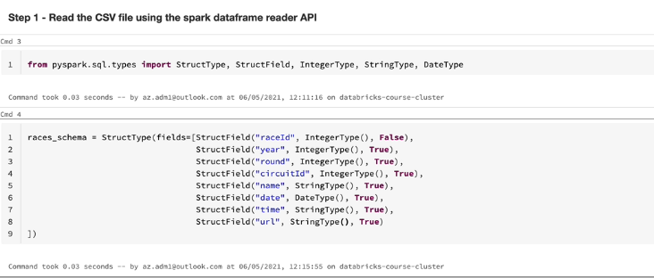

**Use Header to show 1st line as header**

```bash
races_df = spark.read.option("hearder". True) \  # Define header for 1st line
                     .schema(races_schema) \  # Define shchema in above step
                     .csv("/mnt/<sa_name>.raw/races.csv") # Location of your data races.csv
```

- Display it

```bash
display(races_df)
```

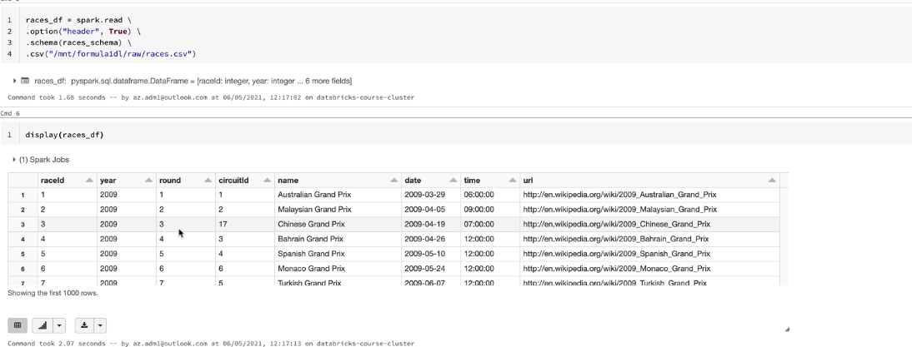

##################################


# Azure Databricks – Races Data Ingestion Pipeline (Beginner Friendly)

---

## 🧠 Big Picture (What are we doing?)

This notebook is doing a **data ingestion pipeline** in Azure Databricks:

👉 Read raw CSV data
👉 Apply proper schema (structure)
👉 Transform data (add columns, fix types)
👉 Select & rename columns
👉 Save into processed layer (Parquet)

---

## 🧱 Step 1: Create Notebook

You created a notebook:

```python
# ingest races file
```

👉 This is just your workspace to write PySpark code.

---

## 📥 Step 2: Understand Source Data (Schema)

### Problem:

CSV file = **unstructured / loosely typed**

👉 Spark may guess wrong datatypes → BAD PRACTICE

---

### Solution:

Define schema manually using:

* `StructType` → full schema
* `StructField` → each column

---

### Example:

```python
from pyspark.sql.types import StructType, StructField, IntegerType, StringType, DateType

races_schema = StructType([
    StructField("raceId", IntegerType(), False),
    StructField("year", IntegerType(), True),
    StructField("round", IntegerType(), True),
    StructField("circuitId", IntegerType(), True),
    StructField("name", StringType(), True),
    StructField("date", DateType(), True),
    StructField("time", StringType(), True)
])
```

---

### 🔥 Function Explanation:

* `StructType()` → Defines complete schema structure
* `StructField()` → Defines each column
* `IntegerType()` → Integer datatype
* `StringType()` → String datatype
* `DateType()` → Date datatype
* `False` → Column cannot be null

---

### 🔥 Important Concept:

| MySQL Type | Spark Type      |
| ---------- | --------------- |
| int        | IntegerType     |
| varchar    | StringType      |
| date       | DateType        |
| time       | ❌ Not available |

👉 So `time` → stored as **String**

---

## 📊 Step 3: Read CSV into DataFrame

```python
races_df = spark.read \
    .option("header", True) \
    .schema(races_schema) \
    .csv("/mnt/formula1dl/raw/races.csv")
```

---

### 🔍 Function Explanation:

* `spark.read` → Entry point to read data in Spark
* `.option("header", True)` → First row is column name
* `.schema()` → Apply predefined schema
* `.csv()` → Read CSV file

---

### 📁 Path Explanation:

```
/mnt/formula1dl/raw/races.csv
```

👉 This is a mounted storage (ADLS/Blob)

* `/mnt` → Mount point
* `formula1dl` → Storage account
* `raw` → Raw data layer

---

## ➕ Step 4: Add New Columns

```python
from pyspark.sql.functions import current_timestamp, to_timestamp, concat, col, lit

races_with_timestamp_df = races_df \
    .withColumn("ingestion_date", current_timestamp()) \
    .withColumn("race_timestamp",
        to_timestamp(
            concat(col("date"), lit(" "), col("time")),
            "yyyy-MM-dd HH:mm:ss"
        )
    )
```

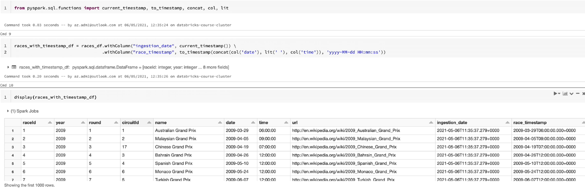


### 🔥 Function Explanation:

* `withColumn()` → Add or modify column
* `current_timestamp()` → Current system timestamp
* `concat()` → Combine multiple columns
* `col()` → Reference a column
* `lit()` → Add constant value (space here)
* `to_timestamp()` → Convert string to timestamp

---

### 🧠 Why this step?

* Add `ingestion_date` → track when data was loaded
* Combine `date` + `time` → create proper timestamp

---

### 🧠 Example:

```
2023-03-05 + 14:00:00 → 2023-03-05 14:00:00
```

---

## 🎯 Step 5: Select & Rename Columns

```python
from pyspark.sql.functions import col

races_selected_df = races_with_timestamp_df.select(
    col("raceId").alias("race_id"),
    col("year").alias("race_year"),
    col("round"),
    col("circuitId").alias("circuit_id"),
    col("name"),
    col("ingestion_date"),
    col("race_timestamp")
)
```

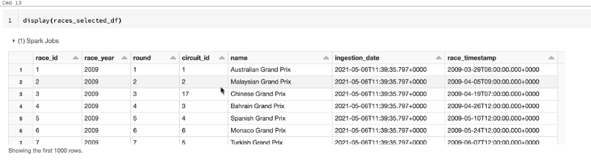


### 🔥 Function Explanation:

* `select()` → Choose required columns
* `alias()` → Rename column

---

### 🧠 Why?

* Clean naming convention
* Remove unnecessary columns

---

## 💾 Step 6: Write Data (Processed Layer)

```python
races_selected_df.write \
    .mode("overwrite") \
    .parquet("/mnt/formula1dl/processed/races")
```

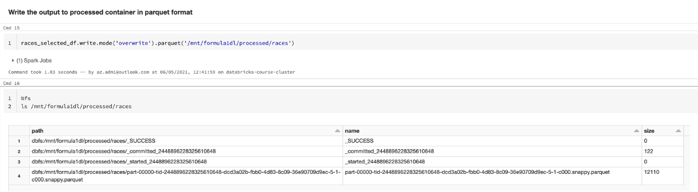


### 🔥 Function Explanation:

* `.write` → Save DataFrame
* `.mode("overwrite")` → Replace existing data
* `.parquet()` → Save in Parquet format

---

## 🚀 Why Parquet?

| CSV ❌      | Parquet ✅     |
| ---------- | ------------- |
| Slow       | Fast          |
| No schema  | Schema stored |
| Large size | Compressed    |


## 📂 Step 7: Validate Output

```python
dbutils.fs.ls("/mnt/formula1dl/processed/races")
```

👉 Lists files

```python
spark.read.parquet("/mnt/formula1dl/processed/races")
```

👉 Read data again

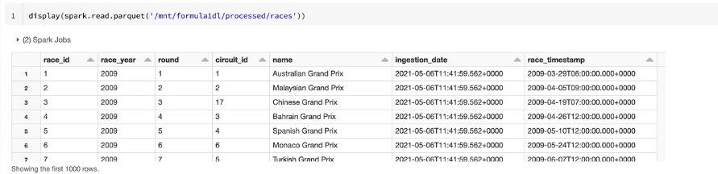


### 🔥 Function Explanation:

* `dbutils.fs.ls()` → List files in storage
* `spark.read.parquet()` → Read parquet file

---

## 🧹 Step 8: Cleanup

Remove unnecessary `display()` commands for clean notebook.

---

## 🧠 FINAL ARCHITECTURE FLOW

```
RAW (CSV)
   ↓
Read with Schema
   ↓
Transform (timestamp + ingestion date)
   ↓
Select + Rename
   ↓
Write
   ↓
PROCESSED (Parquet)
```

---

## 💡 Real-World Understanding

This follows **Medallion Architecture**:

| Layer              | Meaning             |
| ------------------ | ------------------- |
| Raw                | Original data       |
| Processed (Silver) | Cleaned data        |
| Gold               | Business-ready data |


## Partitioning Data

- `👉 Splitting data into multiple folders based on a column value`


- `Without partition:`
👉 Spark scans ALL data ❌

- `With partition:`
👉 Spark reads only required partition ✅

- If you want to `Split Data Based on Column name like` **reace_year** to evaluate or to see Year based Race Data, You can do it with help of `partition`.

- TO DO PARTITION, use `.partitionBy("race_year")` → Split data into folders based on column

```python
races_selected_df.write \
    .mode("overwrite") \
    .partitionBy("race_year") \                   
    .parquet("/mnt/formula1dl/processed/races") # Location of data 
```

```python
display(spark.read.parquet("/mnt/formula1dl/processed/races"))
```

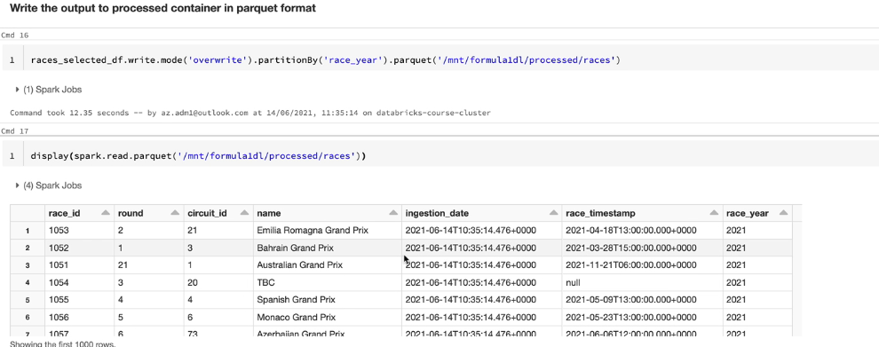

- This is real ex

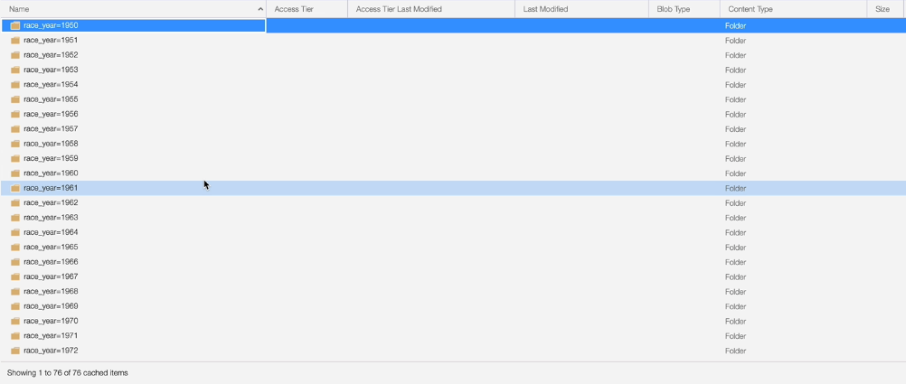

Data Ingestion - JSON
---

We will do Read, Transform, Write on JSON file.

JSON file have following columns.

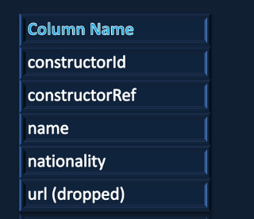

- And Will Transform into this New Column name.

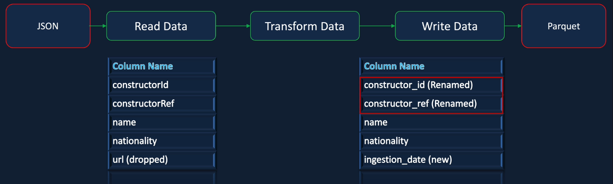

- **`We will also see DDL Method for Schema Set`**.

### Step 1 - Set Schema using DDL

- Instead of using StructType, they used a DDL schema string.


```python
constructors_shema = "constructorId INT, constructorRef STRING, name STRING, nationality STRING, url STRING"
```

### Step 2 - Read JSON File

- Here we wouldn't require to write `header` to read 1st line from file. 

- `JSON will not required to write header`.

```python
constructor_df = spark.read \
    .schema(constructor_schema) \
    .json("/mnt/formula1dl/raw/constructors.json")
```

  - spark.read → starts reading data

  - .schema(...) → applies your schema

  - .json(...) → reads JSON file

- Display

```python
display(constructor_df)
```

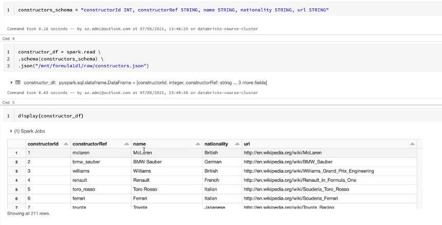

### Step 3 - Drop unwanted columns

- use `drop('column_name')`

```python
constructor_dropped_df = constructor_df.drop('url')
```

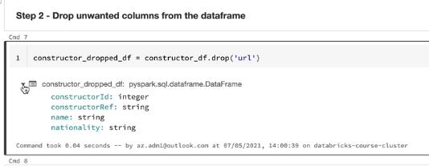

### Step 4 - Rename columns and add Ingestion date

```python
constructor_final_df = constructor_dropped_df.withColumnRenamed("constructorId", "constructor_id") \
                                             .withColumnRenamed("constructorRef", "constructor_ref") \
                                             .withColumn("ingestion_date", current_timestamp())
```

- Display Renamed

```python
display(constructor_final_df)
```

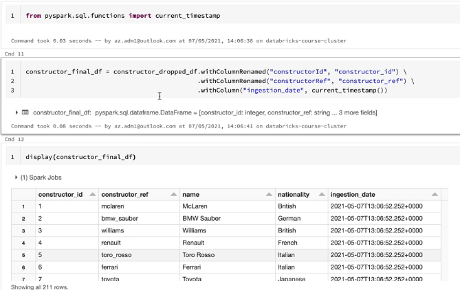

### Step 5 - Write output to parquet format

```python
constructor_final_df.write.mode("overwrite").parquet("/mnt/formula1/processed/")
```

- List processed container

```python
%fs
ls /mnt/formula1/processed/constructors
```

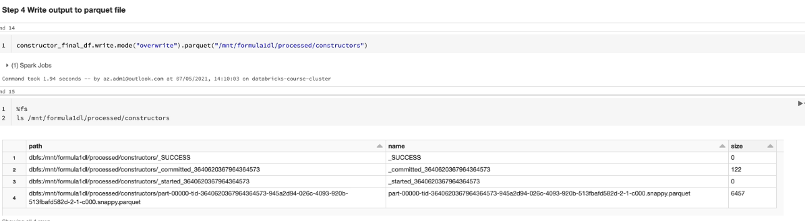

#################################################3

# Azure Databricks – Drivers Data Ingestion (Nested JSON)

## 🧠 Big Picture (What are we doing?)

This notebook is processing a **nested JSON file** in Azure Databricks:

👉 Read JSON data (with nested structure)
👉 Apply schema (including nested schema)
👉 Transform data (flatten nested fields)
👉 Rename & clean columns
👉 Save into processed layer (Parquet)

## 📂 Source Data (Important)

The driver JSON file contains **nested data**:

```json
{
  "driverId": 1,
  "driverRef": "hamilton",
  "name": {
    "forename": "Lewis",
    "surname": "Hamilton"
  },
  "dob": "1985-01-07",
  "nationality": "British",
  "url": "http://..."
}
```

## 🧠 Core Concept

👉 `name` is NOT a normal column
👉 It is a **nested JSON object (struct)**

So we must:

* Define **inner schema** (for name)
* Define **outer schema** (full JSON)

## 🧱 Step 1: Define Inner Schema (Nested Object)

```python
from pyspark.sql.types import StructType, StructField, StringType

name_schema = StructType([
    StructField("forename", StringType(), True),
    StructField("surname", StringType(), True)
])
```

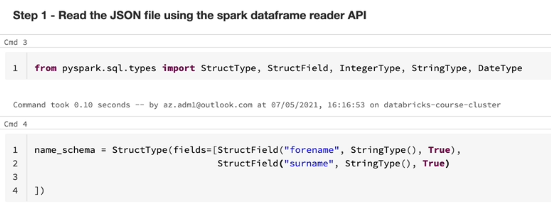

### 🔥 Function Explanation:

* `StructType()` → Defines structure
* `StructField()` → Defines each field
* `StringType()` → String datatype

## 🧱 Step 2: Define Outer Schema

```python
from pyspark.sql.types import IntegerType, DateType

driver_schema = StructType([
    StructField("driverId", IntegerType(), False),
    StructField("driverRef", StringType(), True),
    StructField("number", StringType(), True),
    StructField("code", StringType(), True),
    StructField("name", name_schema, True),
    StructField("dob", DateType(), True),
    StructField("nationality", StringType(), True),
    StructField("url", StringType(), True)
])
```

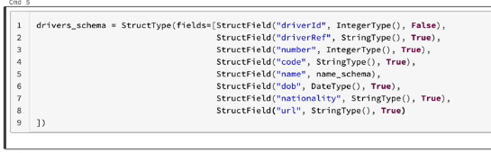

### 🔥 Important Line:

```python
StructField("name", name_schema, True)
```

👉 This means:

* `name` is a struct
* Its structure is defined by `name_schema`

## 📊 Step 3: Read JSON File

```python
drivers_df = spark.read \
    .schema(driver_schema) \
    .json("/mnt/formula1dl/raw/drivers.json")
```

### 🔥 Function Explanation:

* `spark.read` → Read data
* `.schema()` → Apply schema
* `.json()` → Read JSON file

### 🧠 Important Note:

❌ No `header=True` needed
👉 JSON already contains column names

## 🔍 Step 4: Check Schema

```python
drivers_df.printSchema()
```

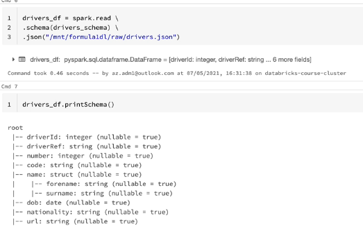

### Output:

```
name: struct
  |-- forename: string
  |-- surname: string
```

## ➕ Step 5: Transform Data (Flatten Nested JSON)

```python
from pyspark.sql.functions import current_timestamp, concat, col, lit

drivers_with_columns_df = drivers_df \
    .withColumn("ingestion_date", current_timestamp()) \
    .withColumn("name",
        concat(col("name.forename"), lit(" "), col("name.surname"))
    )
```

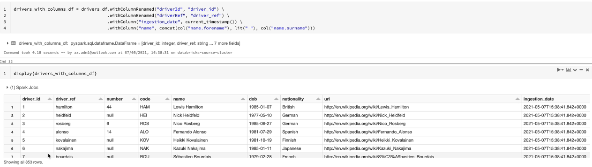

### 🔥 Function Explanation:

* `withColumn()` → Add/modify column
* `current_timestamp()` → Add ingestion time
* `concat()` → Combine columns
* `col("name.forename")` → Access nested field
* `lit(" ")` → Add space

### 🧠 What is happening?

```text
name.forename + " " + name.surname
```

👉 Converts nested object into flat column:

```
Lewis Hamilton
```

## 🎯 Step 6: Drop Unwanted Columns

```python
drivers_final_df = drivers_with_columns_df.drop("url")
```

### 🧠 Why?

* `url` not required
* Nested fields already flattened

## 💾 Step 7: Write Data (Processed Layer)

```python
drivers_final_df.write \
    .mode("overwrite") \
    .parquet("/mnt/formula1dl/processed/drivers")
```

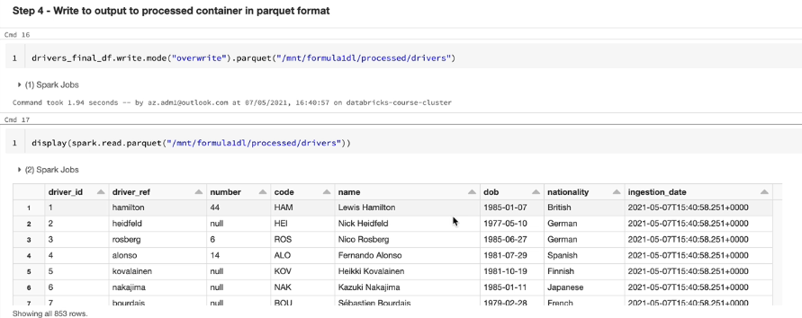

### 🔥 Function Explanation:

* `.write` → Save data
* `.mode("overwrite")` → Replace old data
* `.parquet()` → Save in optimized format

## 🧠 FINAL ARCHITECTURE FLOW

```
RAW (Nested JSON)
   ↓
Read with Nested Schema
   ↓
Flatten Nested Fields
   ↓
Rename + Add Columns
   ↓
Drop Unwanted Columns
   ↓
PROCESSED (Parquet)
```

## 💡 Key Learnings

* Nested JSON requires **nested schema**
* StructType can define complex structures
* Use `col("parent.child")` to access nested fields
* Flatten nested data for analytics

# Azure Databricks – Results Data Ingestion (JSON → Partitioned Parquet)

## 🧠 Big Picture (What are we doing?)

This notebook processes the **results JSON file** and prepares it for analytics:

👉 Read JSON data with schema
👉 Rename columns (clean naming)
👉 Add ingestion timestamp
👉 Drop unwanted columns
👉 Write optimized data to Data Lake (Parquet) with partitioning

## 📂 Source Data

* File: `results.json`
* Format: JSON
* Location: `/mnt/formula1dl/raw/`

## 🧱 Step 1: Define Schema

```python
from pyspark.sql.types import StructType, StructField, IntegerType, StringType, FloatType

results_schema = StructType([
    StructField("resultId", IntegerType(), False),
    StructField("raceId", IntegerType(), True),
    StructField("driverId", IntegerType(), True),
    StructField("constructorId", IntegerType(), True),
    StructField("number", StringType(), True),
    StructField("grid", IntegerType(), True),
    StructField("position", IntegerType(), True),
    StructField("positionText", StringType(), True),
    StructField("positionOrder", IntegerType(), True),
    StructField("points", FloatType(), True),
    StructField("laps", IntegerType(), True),
    StructField("time", StringType(), True),
    StructField("milliseconds", IntegerType(), True),
    StructField("fastestLap", IntegerType(), True),
    StructField("rank", IntegerType(), True),
    StructField("fastestLapTime", StringType(), True),
    StructField("fastestLapSpeed", FloatType(), True),
    StructField("statusId", IntegerType(), True)
])
```

### 🔥 Function Explanation:

* `StructType()` → Defines full schema
* `StructField()` → Defines each column
* `IntegerType()` → Integer values
* `StringType()` → Text values
* `FloatType()` → Decimal values

## 📊 Step 2: Read JSON File

```python
results_df = spark.read \
    .schema(results_schema) \
    .json("/mnt/formula1dl/raw/results.json")
```

### 🔥 Function Explanation:

* `spark.read` → Read data
* `.schema()` → Apply schema
* `.json()` → Read JSON file

### 🧠 Note:

❌ No `header=True` required
👉 JSON already contains column names

## ➕ Step 3: Rename Columns & Add Ingestion Date

```python
from pyspark.sql.functions import current_timestamp, col

results_with_columns_df = results_df.select(
    col("resultId").alias("result_id"),
    col("raceId").alias("race_id"),
    col("driverId").alias("driver_id"),
    col("constructorId").alias("constructor_id"),
    col("number"),
    col("grid"),
    col("position"),
    col("positionText").alias("position_text"),
    col("positionOrder").alias("position_order"),
    col("points"),
    col("laps"),
    col("time"),
    col("milliseconds"),
    col("fastestLap").alias("fastest_lap"),
    col("rank"),
    col("fastestLapTime").alias("fastest_lap_time"),
    col("fastestLapSpeed").alias("fastest_lap_speed"),
    col("statusId").alias("status_id"),
    current_timestamp().alias("ingestion_date")
)
```

### 🔥 Function Explanation:

* `select()` → Select required columns
* `alias()` → Rename columns
* `current_timestamp()` → Add ingestion time

### 🧠 Why this step?

* Convert CamelCase → snake_case
* Add ingestion tracking

## 🗑️ Step 4: Drop Unwanted Columns

```python
results_final_df = results_with_columns_df.drop(col("status_id"))
```

### 🔥 Function Explanation:

* `drop()` → Remove column
* `col()` → Column reference

### 🧠 Why?

* Remove unnecessary data
* Keep dataset clean

## 💾 Step 5: Write Data (Partitioned Output)

```python
results_final_df.write \
    .mode("overwrite") \
    .partitionBy("race_id") \
    .parquet("/mnt/formula1dl/processed/results")
```

### 🔥 Function Explanation:

* `.write` → Save data
* `.mode("overwrite")` → Replace old data
* `.partitionBy("race_id")` → Split data by race
* `.parquet()` → Save in optimized format

## 📂 Partition Output Example

```
/mnt/formula1dl/processed/results/
    race_id=1/
    race_id=2/
    race_id=3/
```

### 🧠 Why Partition?

Without partition:
👉 Full dataset scan ❌

With partition:
👉 Only required data read ✅

### ⚡ Example Query

```
SELECT * FROM results WHERE race_id = 1
```

👉 Reads only `race_id=1` folder → Faster 🚀

## 🔍 Step 6: Validate Output

```python
spark.read.parquet("/mnt/formula1dl/processed/results")
```


# Azure Databricks – Pitstops Data Ingestion (Multiline JSON)

## 🧠 Big Picture (What are we doing?)

This notebook processes a **multiline JSON file** in Azure Databricks:

👉 Read multiline JSON data
👉 Apply schema
👉 Fix parsing issue using `multiLine=True`
👉 Rename columns & add ingestion timestamp
👉 Write optimized data to Data Lake (Parquet)

## 📂 Source Data

* File: `pitstops.json`
* Format: Multiline JSON
* Location: `/mnt/formula1dl/raw/`

## 🧠 Core Concept (VERY IMPORTANT)

### ❌ Default Behavior in Spark

```python
multiLine = False
```

👉 Spark expects JSON like:

```json
{"name":"abc","age":25}
{"name":"def","age":30}
```

### ❌ Problem with Multiline JSON

Actual file looks like:

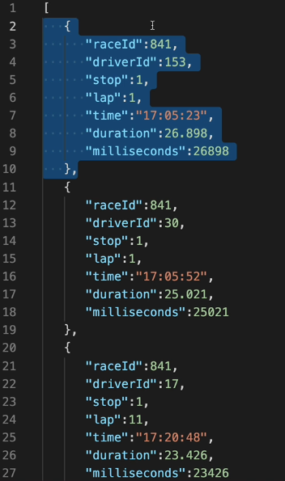

```json
[
  {
    "raceId": 1,
    "driverId": 44,
    "stop": 2
  },
  {
    "raceId": 2,
    "driverId": 5,
    "stop": 3
  }
]
```

👉 JSON records are spread across multiple lines
👉 Spark cannot parse → results in **NULL values**

## ✅ Solution

```python
.option("multiLine", True)
```

👉 This tells Spark to read the entire JSON object properly

## 🧱 Step 1: Define Schema

```python
from pyspark.sql.types import StructType, StructField, IntegerType, StringType

pitstops_schema = StructType([
    StructField("raceId", IntegerType(), True),
    StructField("driverId", IntegerType(), True),
    StructField("stop", IntegerType(), True),
    StructField("lap", IntegerType(), True),
    StructField("time", StringType(), True),
    StructField("duration", StringType(), True),
    StructField("milliseconds", IntegerType(), True)
])
```

### 🔥 Function Explanation:

* `StructType()` → Defines schema
* `StructField()` → Defines each column

## 📊 Step 2: Read Multiline JSON

```python
pitstops_df = spark.read \
    .option("multiLine", True) \
    .schema(pitstops_schema) \
    .json("/mnt/formula1dl/raw/pitstops.json")
```

### 🔥 Function Explanation:

* `spark.read` → Read data
* `.option("multiLine", True)` → Enable multiline JSON support
* `.schema()` → Apply schema
* `.json()` → Read JSON file

### 🧠 Why this works?

👉 Spark now reads the entire JSON structure instead of line-by-line

## ➕ Step 3: Rename Columns & Add Ingestion Date

```python
from pyspark.sql.functions import current_timestamp

final_df = pitstops_df \
    .withColumnRenamed("raceId", "race_id") \
    .withColumnRenamed("driverId", "driver_id") \
    .withColumn("ingestion_date", current_timestamp())
```

### 🔥 Function Explanation:

* `withColumnRenamed()` → Rename columns
* `current_timestamp()` → Add ingestion time

## 💾 Step 4: Write Data (Parquet)

```python
final_df.write \
    .mode("overwrite") \
    .parquet("/mnt/formula1dl/processed/pitstops")
```

### 🔥 Function Explanation:

* `.write` → Save data
* `.mode("overwrite")` → Replace old data
* `.parquet()` → Optimized format

## 🔍 Step 5: Validate Output

```python
spark.read.parquet("/mnt/formula1dl/processed/pitstops")
```

## 🧠 FINAL ARCHITECTURE FLOW

```
RAW (Multiline JSON)
   ↓
Read with multiLine=True
   ↓
Apply Schema
   ↓
Rename + Add ingestion date
   ↓
Write (Parquet)
   ↓
PROCESSED
```

## 💡 Key Learnings

* Multiline JSON needs special handling
* Use `.option("multiLine", True)`
* Schema still required for consistency

#########################################################

# Azure Databricks – Lap Times Data Ingestion (Multiple CSV Files)

## 🧠 Big Picture (What are we doing?)

This notebook processes **multiple CSV files from a folder** in Azure Databricks:

👉 Read multiple CSV files (from folder)
👉 Apply schema
👉 Combine all files into one DataFrame
👉 Rename columns & add ingestion timestamp
👉 Write optimized data to Data Lake (Parquet)

## 📂 Source Data

* Folder: `lap_times/`
* Format: CSV (multiple files)
* Location: `/mnt/formula1dl/raw/`

- This is how our lap_time/*.csv format.

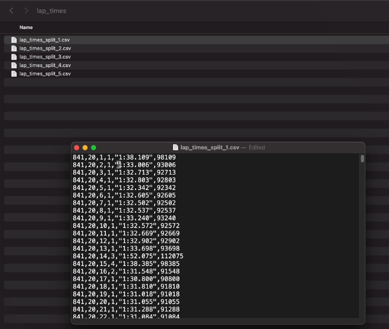

## 🧠 Core Concept (VERY IMPORTANT)

👉 Spark treats **all files in a folder as one dataset**

Example:

```
lap_times/
  part-1.csv
  part-2.csv
  part-3.csv
  part-4.csv
  part-5.csv
```

👉 Spark reads all files together → creates **one DataFrame**

## 🧱 Step 1: Define Schema

```python
from pyspark.sql.types import StructType, StructField, IntegerType

lap_times_schema = StructType([
    StructField("raceId", IntegerType(), True),
    StructField("driverId", IntegerType(), True),
    StructField("lap", IntegerType(), True),
    StructField("position", IntegerType(), True),
    StructField("time", StringType(), True),
    StructField("milliseconds", IntegerType(), True)
])
```

### 🔥 Function Explanation:

* `StructType()` → Defines schema
* `StructField()` → Defines each column

## 📊 Step 2: Read Multiple CSV Files (Folder)

```python
lap_times_df = spark.read \
    .schema(lap_times_schema) \
    .csv("/mnt/formula1dl/raw/lap_times/")
```

### 🔥 Function Explanation:

* `spark.read` → Read data
* `.schema()` → Apply schema
* `.csv()` → Read CSV files from folder

### 🧠 What happens here?

👉 Spark automatically:

* Reads all CSV files in the folder
* Combines them into one DataFrame

## ⭐ Optional: Use Wildcard Path

```python
lap_times_df = spark.read \
    .schema(lap_times_schema) \
    .csv("/mnt/formula1dl/raw/lap_times/*.csv")
```

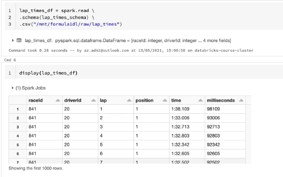

### 🧠 Why use wildcard?

👉 Useful when folder contains multiple file types

Example:

* `.csv`
* `.json`
* `.txt`

👉 `*.csv` ensures only CSV files are read

## 🔍 Step 3: Validate Data

```python
lap_times_df.count()
```

### 🧠 Why?

* Ensure all files are read
* Verify total record count

Example:

* 5 files × ~100k rows = ~500k records

## ➕ Step 4: Rename Columns & Add Ingestion Date

```python
from pyspark.sql.functions import current_timestamp

final_df = lap_times_df \
    .withColumnRenamed("raceId", "race_id") \
    .withColumnRenamed("driverId", "driver_id") \
    .withColumn("ingestion_date", current_timestamp())
```

### 🔥 Function Explanation:

* `withColumnRenamed()` → Rename columns
* `current_timestamp()` → Add ingestion time


## 💾 Step 5: Write Data (Parquet)

```python
final_df.write \
    .mode("overwrite") \
    .parquet("/mnt/formula1dl/processed/lap_times")
```


### 🔥 Function Explanation:

* `.write` → Save data
* `.mode("overwrite")` → Replace old data
* `.parquet()` → Optimized format


## 🔍 Step 6: Validate Output

```python
spark.read.parquet("/mnt/formula1dl/processed/lap_times")
```

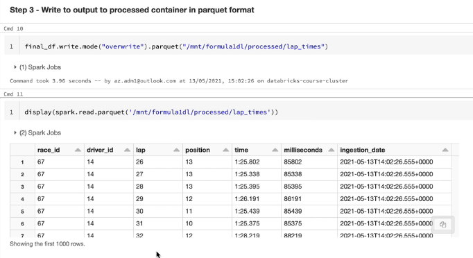

## 🧠 FINAL ARCHITECTURE FLOW

```
RAW (Multiple CSV Files)
   ↓
Read Folder
   ↓
Apply Schema
   ↓
Combine Files Automatically
   ↓
Rename + Add ingestion date
   ↓
Write (Parquet)
   ↓
PROCESSED
```


# Qualifying Data Ingestion using Azure Databricks

## 📌 Overview

This project demonstrates how to ingest **Qualifying JSON data** into a processed data layer using Azure Databricks. The pipeline reads raw JSON files, applies schema, transforms data, and writes it in Parquet format.


## 📂 Data Flow

**Raw Layer → Transformation → Processed Layer**

* Source: `/mnt/raw/qualifying`
* Target: `/mnt/processed/qualifying`

This we would have to modify columns and add new columns

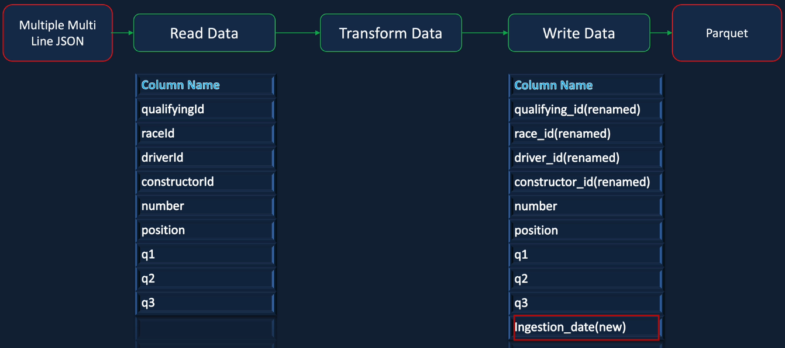

This is how our data is look like.


Data is like multi line json files.

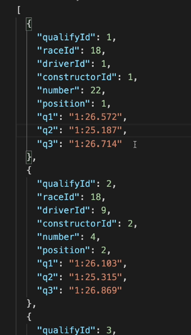

## ⚙️ Steps

### 1. Read JSON Files

* Reads multiple JSON files from a folder
* Uses predefined schema
* Handles multi-line JSON

```python
from pyspark.sql.types import StructType, StructField, IntegerType, StringType

qualifying_schema = StructType([
    StructField("qualifyId", IntegerType(), True),
    StructField("raceId", IntegerType(), True),
    StructField("driverId", IntegerType(), True),
    StructField("constructorId", IntegerType(), True),
    StructField("number", IntegerType(), True),
    StructField("position", IntegerType(), True),
    StructField("q1", StringType(), True),
    StructField("q2", StringType(), True),
    StructField("q3", StringType(), True)
])

df = spark.read \
    .option("multiLine", True) \
    .schema(qualifying_schema) \
    .json("/mnt/raw/qualifying")
```

### 2. Transform Data

#### Rename Columns

* Convert camelCase → snake_case

#### Add Ingestion Timestamp

```python
from pyspark.sql.functions import current_timestamp

qualifying_final_df = df \
    .withColumnRenamed("qualifyId", "qualify_id") \
    .withColumnRenamed("raceId", "race_id") \
    .withColumnRenamed("driverId", "driver_id") \
    .withColumnRenamed("constructorId", "constructor_id") \
    .withColumn("ingestion_date", current_timestamp())
```

### 3. Write Data

* Format: Parquet
* Mode: Overwrite

```python
qualifying_final_df.write \
  .mode("overwrite") \
  .format("parquet") \
  .save("/mnt/processed/qualifying")
```

### 4. Validate Data (Display)

```python
display(spark.read.parquet("/mnt/processed/qualifying"))
```


# Azure Databricks – Workflow & Productionization (Overview)

## 🧠 Purpose of This Section

This section focuses on converting your existing Databricks notebooks into **production-ready data pipelines**.

Instead of running notebooks manually, you will learn how to:

👉 Automate execution
👉 Reuse code across notebooks
👉 Pass dynamic parameters
👉 Chain multiple notebooks into workflows
👉 Schedule and manage executions using Databricks Jobs

## 🎯 What You Will Learn

### 1. Reusing Code Across Notebooks

* How to include one notebook inside another
* Centralize common logic (configs, utility functions)
* Avoid code duplication

### 2. Parameterizing Notebooks

* Define input parameters using widgets
* Pass dynamic values (env, paths, dates)
* Make notebooks reusable across environments (dev/test/prod)

### 3. Notebook Orchestration

* Call one notebook from another
* Create end-to-end workflows
* Control execution order of multiple ingestion notebooks

### 4. Passing Parameters Between Notebooks

* Send values from parent to child notebook
* Use parameters to control logic dynamically
* Build flexible pipelines

### 5. Creating Databricks Jobs

* Run notebooks automatically
* Schedule jobs (daily/hourly/on-demand)
* Monitor execution status
* Handle failures and retries


# Azure Databricks – Reusability using %run (Configuration + Common Functions)

## 🧠 Big Picture (What are we doing?)

In this step, we improve our ingestion notebooks to make them **production-ready and reusable**.

Instead of hardcoding values and repeating logic, we:

👉 Move configuration (paths) into a separate notebook
👉 Move common logic (functions) into another notebook
👉 Reuse them using `%run`


## ❌ Problem (Before)

Each ingestion notebook contains:

* Hardcoded paths
  n

```python
"/mnt/formula1dl/raw"
"/mnt/formula1dl/processed"
```

* Repeated logic

```python
.withColumn("ingestion_date", current_timestamp())
```

### ⚠️ Issues

* Difficult to maintain
* Changes required in multiple notebooks
* Not suitable for multiple environments (dev/test/prod)


## ✅ Solution (After)

We split logic into **three parts**:

```
includes/
   configuration
   common_functions

ingestion/
   circuits
   races
   drivers
```


## 📁 1. Configuration Notebook

**1. Reusing Code Across Notebooks**

Stores reusable variables (paths)

```python
raw_folder_path = "/mnt/formula1dl/raw"
processed_folder_path = "/mnt/formula1dl/processed"
presentation_folder_path = "/mnt/formula1dl/presentation"
```


### 🧠 Purpose

* Avoid hardcoding
* Centralize configuration
* Easy environment switch


## 📁 2. Common Functions Notebook

Stores reusable functions

```python
from pyspark.sql.functions import current_timestamp


def add_ingestion_date(input_df):
    output_df = input_df.withColumn("ingestion_date", current_timestamp())
    return output_df
```


### 🧠 Function Explanation

* Takes a DataFrame (`input_df`)
* Adds `ingestion_date`
* Returns updated DataFrame


## ⚡ 3. Using %run in Ingestion Notebook

```python
%run ../includes/configuration
%run ../includes/common_functions
```


### 🔥 What %run does

* Executes another notebook
* Makes all variables and functions available


## 🔁 Using Configuration Variables

```python
circuits_df = spark.read \
    .option("header", True) \
    .schema(circuits_schema)
    .csv(f"{raw_folder_path}/circuits.csv")
```

```python
df.write.parquet(f"{processed_folder_path}/circuits")
```


## 🔁 Using Common Function

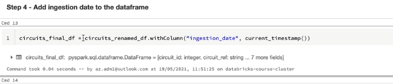


```python
circuits_final_df = add_ingestion_date(circuits_renamed_df)
```


### 🧠 Important Concept

* `input_df` is NOT automatic
* You pass it while calling function

```python
add_ingestion_date(circuits_df)
```

👉 `circuits_df` becomes `input_df`

## 🧠 Flow Summary

```
Ingestion Notebook
   ↓
%run configuration → variables available
%run common_functions → functions available
   ↓
Read DataFrame
   ↓
Call function (pass DataFrame)
   ↓
Write output
```

## ⚠️ Important Rules

* `%run` must be in separate cell
* Path should be correct (`../includes/...`)
* Always run `%run` before using variables/functions


# 2. Parameterizing Notebooks

Earlier, `%run` was used to **reuse code** from another notebook.

Now, widgets are used to **reuse the same notebook with different input values**.

So:

* `%run` → reuse **code**
* widgets/parameters → reuse **the notebook itself**


# Why this is useful

Suppose you have the same kind of data coming from:

* Ergast API
* official Formula 1 website

The structure is similar, so you do **not** want two separate notebooks.

Instead, you use one notebook and pass a parameter like:

```python
data_source = "ergast"
```

or

```python
data_source = "formula1_official"
```

Then the notebook stores that value in the output.


# What is a widget?

A widget is just a **Databricks input box** for a notebook.

It can be:

* text box
* dropdown
* combobox
* multiselect

In this lesson, they use a **text widget** because it is the simplest.


# Step 1: Create the widget

```python
dbutils.widgets.text("p_data_source", "")
```

## What this means

* `p_data_source` = widget name
* `""` = default value

This creates a notebook parameter named `p_data_source`.

The `p_` prefix usually means **parameter**.


# Step 2: Read the widget value

```python
v_data_source = dbutils.widgets.get("p_data_source")
```

## What this means

* `dbutils.widgets.get(...)` fetches the value entered in the widget
* `v_data_source` stores that value in a normal Python variable

So if you type:

```python
testing
```

into the widget, then:

```python
v_data_source
```

will contain `"testing"`.


# Important idea

The widget is the **input box**.

The variable is the **value you read from that box**.

So:

* widget name: `p_data_source`
* variable name: `v_data_source`


# Step 3: Add the value to the DataFrame

They add a new column called `data_source`.

```python
.withColumn("data_source", lit(v_data_source))
```

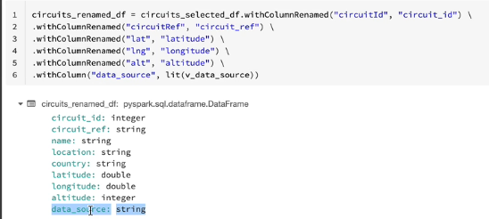

## Why `lit()`?

Because `v_data_source` is just a Python string.

Spark cannot directly add a plain string as a DataFrame column.

So `lit()` converts the string into a Spark column value.

Example:

```python
lit("testing")
```

becomes a column value that Spark can place into every row.


# What happens in the output?

If you pass:

```python
testing
```

then every row gets:

```text
data_source = testing
```

So now the output data clearly shows where it came from.


# Why this matters in real projects

This is very useful for:

* tracking source system
* handling multiple environments
* same notebook for different datasets
* easier maintenance

For example, the same notebook can run for:

* dev
* test
* prod

just by changing the widget value.


# Simple flow

```text
Widget created
   ↓
User passes value at runtime
   ↓
dbutils.widgets.get reads it
   ↓
Value stored in variable
   ↓
lit() converts it to Spark column
   ↓
Added to DataFrame
   ↓
Written to Parquet
```


# Difference from `%run`

This is the part that usually confuses people:

* `%run` brings in **other notebook code**
* widgets pass in **runtime input values**

They solve different problems.

# 3. Notebook Orchestration

# Azure Databricks – Notebook Workflow (dbutils.notebook.run)


## 🧠 Big Picture (What are we doing?)

In this step, we are moving from **manual execution of notebooks** to building a **workflow (pipeline)**.

Instead of running notebooks one by one:

👉 We create a **master notebook**
👉 That notebook will **call other notebooks**
👉 Pass parameters to them
👉 Capture their result (success/failure)
👉 Decide next execution based on result


## ❌ Problem (Before)

* Notebooks executed manually
* No control over execution order
* No dependency handling
* No success/failure tracking


## ✅ Solution (Notebook Workflow)

Use Databricks utility:

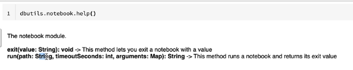

- To Execute Notebook use `notebook.run()`

```python
dbutils.notebook.run()
```

and to get notebook execution result `Success` or `Failed` use `notebook.exit()`

```python
dbutils.notebook.exit()
```


## 🧱 Architecture

```
Master Notebook (0.ingest_all_files)
        ↓
   Runs child notebooks
        ↓
circuits → races → drivers → results → ...
```


## 🚀 Step 1: Create Master Notebook

Example:

```python
0.ingest_all_files
```

👉 This notebook controls the entire workflow


## ⚙️ Step 2: Run Another Notebook

```python
v_result = dbutils.notebook.run(
    "/ingestion/1.ingest_circuits",
    0,
    {"p_data_source": "Ergast API"}
)
```


**1.ingest_circuits** `has runned and executed all cells`.

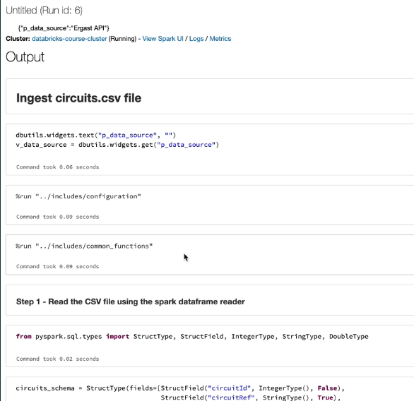

### 🔍 Explanation

| Parameter     | Meaning               |
| ------------- | --------------------- |
| notebook path | which notebook to run |
| timeout = 0   | no timeout            |
| dictionary    | parameters to pass    |


## 🔁 Parameter Passing

```python
{"p_data_source": "Ergast API"}
```

👉 Passed into child notebook widget

Child notebook receives using:

```python
v_data_source = dbutils.widgets.get("p_data_source")
```


## 📤 Step 3: Return Status from Child Notebook

Inside child notebook:

```python
dbutils.notebook.exit("success")
```


### 🧠 What this does

* Sends result back to parent notebook
* Helps track execution status


## 📥 Step 4: Capture Result in Parent Notebook

```python
v_result = dbutils.notebook.run(...)
```

```python
print(v_result)
# output: success
```

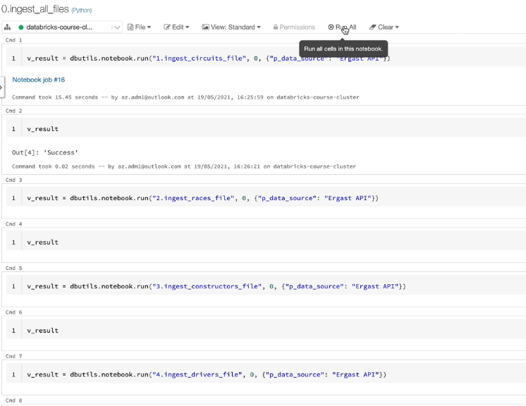

- Its Result

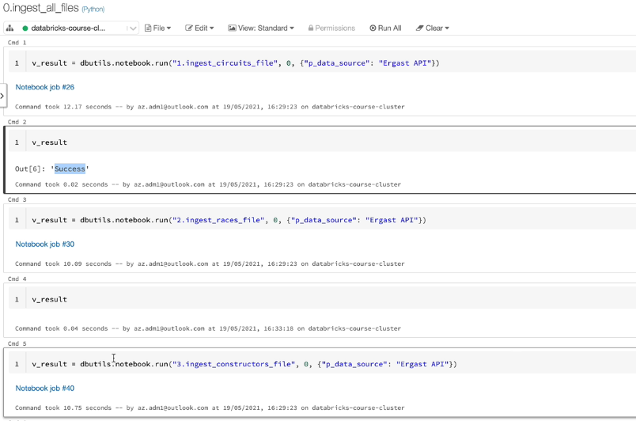

## 🔗 Step 5: Create Dependency Logic

```python
if v_result == "success":
    # run next notebook
else:
    # stop execution
```


## 🧠 Workflow Execution Flow

```
Run Notebook A
   ↓
Return "success"
   ↓
If success → Run Notebook B
   ↓
Return "success"
   ↓
Continue...
```

---

## ⚠️ Important Behavior

* Execution is **sequential**
* Next notebook waits for previous to finish

---

## ⚡ Parallel Execution (Advanced)

* Possible using Python threading
* Not recommended in Databricks

👉 Better to use Azure Data Factory for:

* parallel execution
* retries
* monitoring

---

## 🧠 Key Concepts Summary

| Concept               | Purpose              |
| --------------------- | -------------------- |
| dbutils.notebook.run  | run another notebook |
| dbutils.notebook.exit | return result        |
| parameters            | pass runtime values  |
| if condition          | control flow         |


# Databrick Jobs

- Databricks Job lets you schedule or manually run a notebook on a cluster at a chosen time or interval, and you can pass parameters into the notebook when the job runs.

### Step 1 - Create Job

- Create Job, Select Schedule Type as Manual, Choose Notebook Path, Create Cluster for this Job

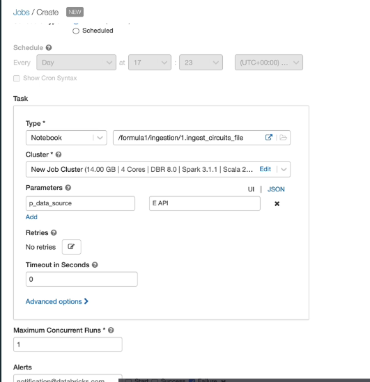

- You can pass the Parameter during creating job to pass this in selected notebooks.

- **p_data_source** - Value `E_API`.


- Create required cluster.

################################


# Spark Filter Transformation – README

The **Filter Transformation** in Apache Spark is used to **select rows from a DataFrame based on a condition**.

It is equivalent to the **`WHERE` clause in SQL**.

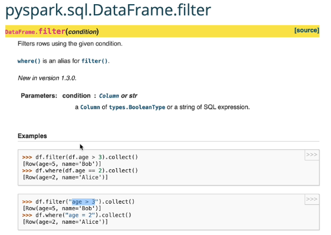

## 🔑 Key Concept

```text
filter() = keep only rows that satisfy a condition
```


## 🧠 Syntax Options

Spark provides **two ways** to use filter:

### 1. SQL Style

```python
filtered_df = df.filter("column = value")
```

### 2. Python (DataFrame) Style

```python
filtered_df = df.filter(df.column == value)
```


## 📊 Example Dataset

Assume a DataFrame `races_df` with columns:

* `year`
* `round`


## 🔍 Single Condition Filter

### SQL Style

```python
%run "../includes/configuration"
```


```python
races_df = spark.read.parquet(f"{processed_folder_path}/races")
```

```python
races_filtered_df = races_df.filter("race_year = 2019")
```

- Display filter

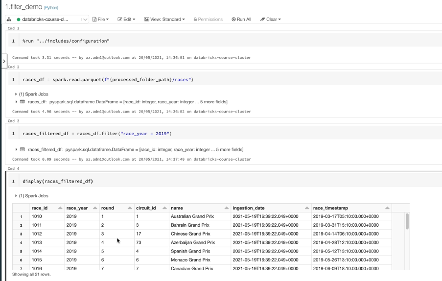

- **You can see that column of `race_year` has printed for `2019` only**.

### Python Style

```python
races_filtered_df = races_df.filter(races_df.year == 2019)
```

📌 Note:

* Use `==` in Python (NOT `=`)


## 🔗 Multiple Conditions

### SQL Style

**Use and**

```python
races_filtered_df = races_df.filter("year = 2019 AND round <= 5")
```

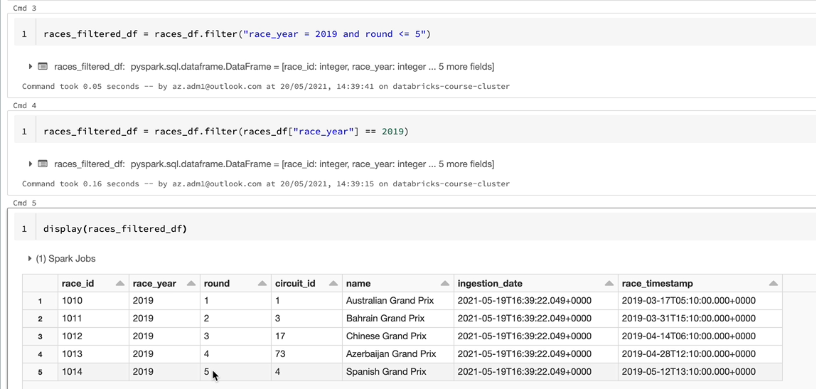

### Python Style

**Use &**  and **Use ()** for Multi Conditions

```python
races_filtered_df = races_df.filter(
    (races_df.year == 2019) & (races_df.round <= 5)
)
```

📌 Important Rules:

* Use `&` instead of `AND`
* Use `|` instead of `OR`
* Wrap each condition in parentheses


## 🔄 filter() vs where()

```python
df.filter("year = 2019")
df.where("year = 2019")
```

✅ Both are **identical**


# Join Transformations

- This is Join Transformations Formula

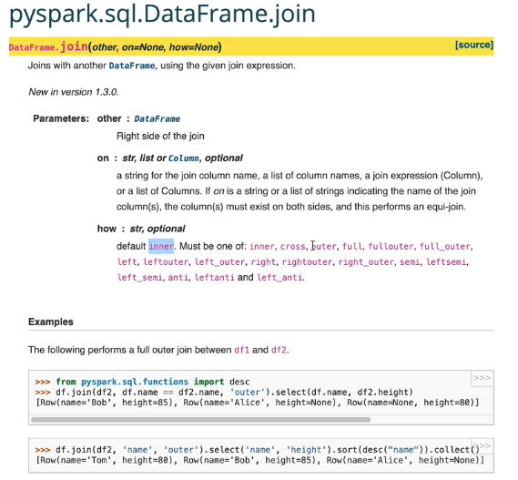

We have 2 diff datasets like `circuits_df` has circuits details & `races_df` has race details.

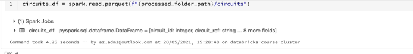


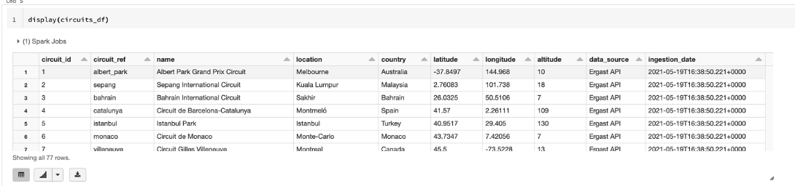


- This is races datasets

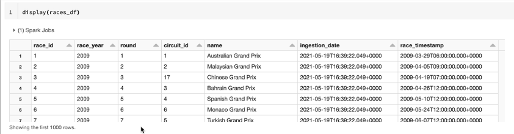

- Write Join transformations

**Join Transformations** - Will match `circuits_id` should exists in both df.

- Also circuits_id's each raw's key should always match with right side df's circuits_id's key.

- If not match, it will not print that raw.

- `As you can see , circuit_id 1st key is 1 = circuits_id in right side df key is 1.


```python
race_circuits_df = circuits_df.join(races_df, circuits_df.circuits_id == races_df.circuits_id, "inner")
```

- Display it.

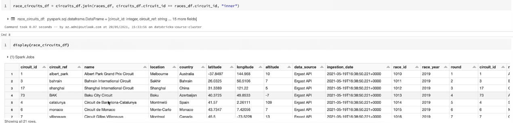

- **To print only selected columns after join**, `Use .select`.

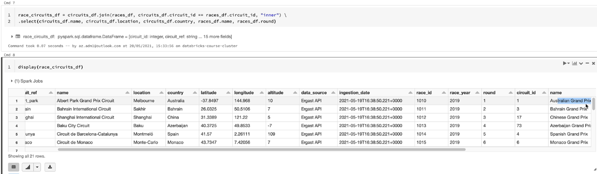

## 2. left = left outer

LEFT JOIN =

- Keep ALL rows from LEFT table
+
- Attach matching rows from RIGHT
+
- If no match → NULL

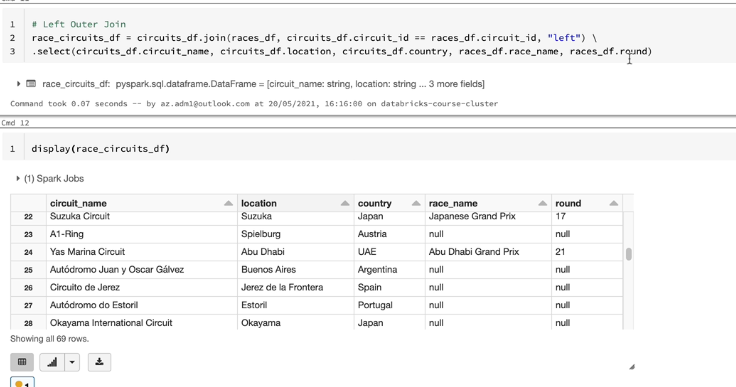


## 3. right = right outer

RIGHT JOIN =

- Keep all rows from RIGHT table

- Attach matchig rows from LEFT 

- If no match - NULL

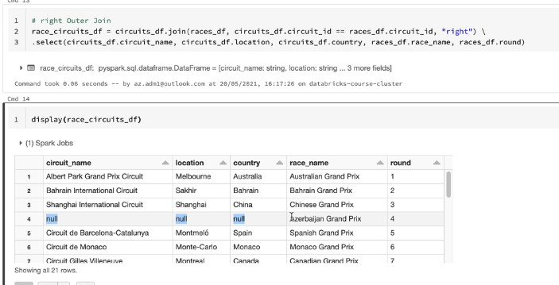

## 4. Full Outer

- Keep all rows from both table

- column name matchs - `circuits_id` exists in both table and if left side df has not match with key with right df - left side df key will `NULL`.

- If right side df has not match with key with left df - right side df key will `NULL`.

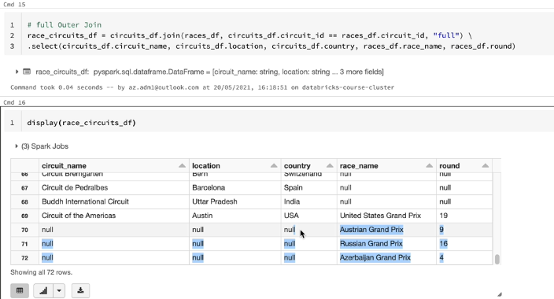

## 5. Left Anti Joins

- Keep ONLY rows from LEFT

- WHERE **NO match** exists in RIGHT

**LEFT ANTI = FIND NON-MATCHING ROWS**

## 6. LEFT Semi Joins

- Keep ONLY rows from LEFT

- `WHERE match exists in RIGHT`

👉 Important:

- Returns ONLY LEFT columns

- RIGHT columns are NOT included

## 7. CROSS JOINS

`Combine EVERY row of LEFT with EVERY row of RIGHT`

```python
df1.crossJoin(df2).show()
```

| Left_id | name |------------- | code | city |
| -- | ---- | ----------------- | ---- | ---- |
| 1  | A    | ----------------- | 10 | X |
| 2  | B    | ----------------- | 20 | Y |


`OutPut`

| id | name | code | city |
| -- | ---- | ---- | ---- |
| 1  | A    | 10   | X    |
| 1  | A    | 20   | Y    |
| 2  | B    | 10   | X    |
| 2  | B    | 20   | Y    |


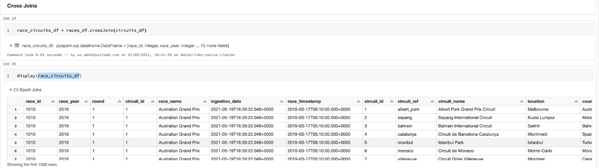

# Spark Aggregations

## 📌 Overview

This section focuses on **Aggregate Functions in Apache Spark (Databricks)**, which are used to **summarize and analyze data**.

Aggregation is a core concept in data engineering and analytics, helping transform raw data into meaningful insights.


## 🔑 Key Concept

```text
Aggregation = converting multiple rows into summarized results
```


## 🧠 What You Will Learn

### 1. Simple Aggregate Functions

Spark provides built-in functions such as:

* `sum()` → total value
* `avg()` → average value
* `min()` → smallest value
* `max()` → largest value
* `count()` → number of records

📌 Example Use Cases:

* Total points scored by drivers
* Average lap time
* Maximum speed in races


### 2. Grouped Aggregations (`groupBy`)

Used to calculate aggregates **per group**.

```python
df.groupBy("column").agg(...)
```

📌 Example Use Cases:

* Total points per driver
* Average performance per constructor
* Race count per season


## 🔍 SQL Equivalent

```sql
SELECT column, SUM(value)
FROM table
GROUP BY column
```


### 3. Window Functions

Used to perform calculations across a **set of rows related to the current row**.

Common functions:

* `rank()` → ranking rows
* `lead()` → next row value
* `lag()` → previous row value

📌 Example Use Cases:

* Rank drivers by points
* Compare current race with previous race
* Track performance trends


## 🏎️ Real Use Case (F1 Project)

Using aggregation to build:

### Driver Standings

* Total points per driver
* Rank drivers within a season

### Constructor Standings

* Total points per team
* Compare team performance


## 🔄 Data Flow

```text
Raw Data → Aggregation → Insights → Reports / Dashboards
```

# Grouped Aggregations in Azure Databricks (PySpark)

## 📌 Overview

Grouped aggregations allow you to:

* Group data based on one or more columns
* Apply aggregation functions (sum, count, avg, etc.)
* Produce summarized results (one row per group)


## 🧠 Concept in Simple Terms

Imagine you have race data where each row represents a driver's performance in a race.

### Before Grouping

Multiple rows per driver:

| driver         | race  | points |
| -------------- | ----- | ------ |
| Lewis Hamilton | Race1 | 25     |
| Lewis Hamilton | Race2 | 18     |
| Alex Albon     | Race1 | 10     |

### After Grouping

One row per driver:

| driver         | total_points | number_of_races |
| -------------- | ------------ | --------------- |
| Lewis Hamilton | 347          | 16              |
| Alex Albon     | 105          | 17              |


## 🔧 Key Functions

### 1. groupBy()

Groups the DataFrame based on column(s).

```python
df.groupBy("driver")
```

👉 Returns a **GroupedData object** (not final data yet)

### 2. Aggregation Functions

Common functions:

* `sum()` → total
* `count()` → number of rows
* `countDistinct()` → unique count
* `avg()` → average
* `min()` / `max()` → minimum / maximum


### 3. agg()

Used to apply **multiple aggregations at once**.

```python
from pyspark.sql.functions import sum, countDistinct

result_df = df.groupBy("driver").agg(
    sum("points"),
    countDistinct("race_name")
)
```


## ⚠️ Important Behavior

### ❌ This will NOT work for multiple aggregations

```python
df.groupBy("driver").sum("points").countDistinct("race_name")
```

Reason:

* `.sum()` returns a **DataFrame**
* You lose the grouped context


### ✅ Correct Approach

Use `agg()` for multiple calculations:

```python
from pyspark.sql.functions import sum, countDistinct

result_df = df.groupBy("driver").agg(
    sum("points").alias("total_points"),
    countDistinct("race_name").alias("number_of_races")
)

result_df.show()
```


## 🏷️ Column Renaming

Use `alias()` to give meaningful column names:

```python
sum("points").alias("total_points")
```

## 📊 Output Example

| driver         | total_points | number_of_races |
| -------------- | ------------ | --------------- |
| Lewis Hamilton | 347          | 16              |
| Max Verstappen | 214          | 17              |
| Alex Albon     | 105          | 17              |


## 🛠️ Quick Test Snippet

```python
from pyspark.sql import SparkSession
from pyspark.sql.functions import sum, countDistinct

spark = SparkSession.builder.getOrCreate()

# Sample Data
sample_data = [
    ("Lewis Hamilton", "Race1", 25),
    ("Lewis Hamilton", "Race2", 18),
    ("Alex Albon", "Race1", 10),
    ("Alex Albon", "Race2", 12)
]

columns = ["driver", "race_name", "points"]

df = spark.createDataFrame(sample_data, columns)

result_df = df.groupBy("driver").agg(
    sum("points").alias("total_points"),
    countDistinct("race_name").alias("number_of_races")
)

result_df.show()
```


#############################################


# Access DataFrame using SQL in Azure Databricks (Temp Views)

## 📌 Overview

how to access a **PySpark DataFrame using SQL** in Azure Databricks by creating a **temporary view**.

This allows you to combine:

* SQL queries (easy and readable)
* PySpark DataFrame API (flexible and powerful)


## 🧠 Concept in Simple Terms

Think of it like this:

* DataFrame → actual data in Spark
* Temporary View → SQL table name for that DataFrame
* SQL → used to query the DataFrame


## 🔄 Workflow

1. Load data into a DataFrame
2. Create a temporary view
3. Query using SQL
4. (Optional) Use SQL inside Python


## 🔧 Step 1: Read Data into DataFrame

```python
results_df = spark.read.parquet("/mnt/processed/race_results")
```


## 🔧 Step 2: Create Temporary View

```python
results_df.createOrReplaceTempView("v_race_results")
```

- `"v_race_results"` - is just a **name of table in SQL** we created temporary.

👉 This creates a SQL-accessible view


## 🔍 Step 3: Query using SQL Cell

```sql
%sql
SELECT * FROM v_race_results
```

### Filter Example

```sql
%sql
SELECT * FROM v_race_results WHERE race_year = 2020
```

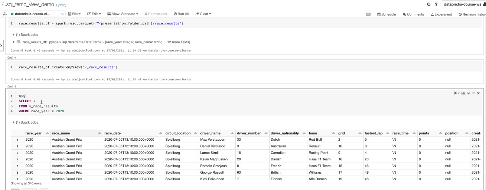

- Create vars and use in SQL Query

```python
p_race_year = 2020
```

```python
race_results_2020_df = spark.sql(f"SELECT * FROM v_race_results WHERE race_year = {p_race_year}")
```

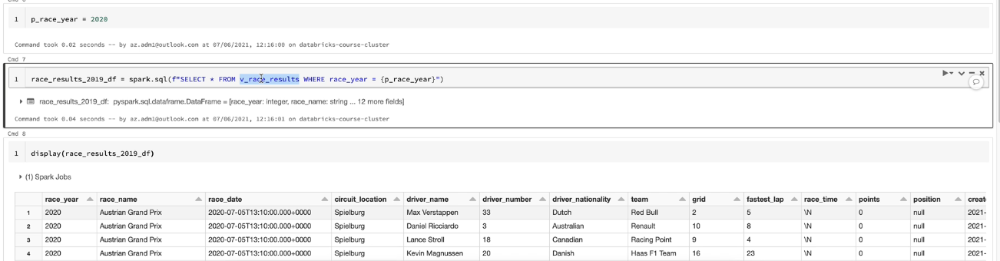

### Aggregation Example

```sql
%sql
SELECT COUNT(*) FROM v_race_results
```


## 🔁 Step 4: Run SQL from Python

```python
df_2019 = spark.sql("SELECT * FROM v_race_results WHERE race_year = 2019")

display(df_2019)
```

👉 Output will be a DataFrame


## 🔄 Dynamic SQL using Variables

```python
race_year = 2019

query = f"SELECT * FROM v_race_results WHERE race_year = {race_year}"

df = spark.sql(query)
```

👉 Useful for parameterized queries and loops


## ⚠️ Important Behavior (Temporary View Limitations)

Temporary views are:

* Available only in the current notebook/session
* Not accessible from other notebooks
* Lost after cluster restart or detach/attach


## ❌ Common Issue

Using this repeatedly may fail:

```python
results_df.createTempView("v_race_results")
```

Error: View already exists


## ✅ Recommended Approach

```python
results_df.createOrReplaceTempView("v_race_results")
```

👉 Safe for re-running notebooks


## 🔁 When to Use What

| Approach      | Use Case                         |
| ------------- | -------------------------------- |
| `%sql` cell   | Quick analysis / exploration     |
| `spark.sql()` | When working inside Python logic |


## 🚀 DevOps Perspective

Think of this like:

* DataFrame = logs/metrics dataset
* Temp View = logical table
* SQL = querying logs (similar to Kibana / KQL / Splunk)

Use cases:

* Filter logs by time
* Count errors
* Aggregate metrics


## 🧠 One-Line Memory Trick

> Temp View = DataFrame exposed as SQL table


## 📌 Summary

* Use `createOrReplaceTempView()` to expose DataFrame as SQL table
* Query using `%sql` or `spark.sql()`
* Temporary views exist only within the session
* Best for mixing SQL + PySpark workflows


## 🛠️ Quick Test Snippet

```python
from pyspark.sql import SparkSession

spark = SparkSession.builder.getOrCreate()

# Sample Data
sample_data = [
    (2020, "Race1"),
    (2019, "Race2")
]

columns = ["race_year", "race_name"]

df = spark.createDataFrame(sample_data, columns)

# Create Temp View
df.createOrReplaceTempView("v_race_results")

# Query
df_result = spark.sql("SELECT * FROM v_race_results WHERE race_year = 2020")

df_result.show()
```

# Global Temporary Views in Azure Databricks (PySpark)

## 📌 Overview

how to use **Global Temporary Views** in Azure Databricks.

Global temp views allow you to:

* Share DataFrames across multiple notebooks
* Run SQL queries on shared data
* Avoid reloading data multiple times


## 🧠 Concept in Simple Terms

Think of it like this:

* DataFrame → actual data in Spark
* Global Temp View → shared SQL table (within same cluster)
* SQL → used to query the data

* Local Temp View - Is only aviable till Sessions/Specific Notebook only.


## 🔄 Workflow

1. Load data into a DataFrame
2. Create a global temp view
3. Query using SQL or Python
4. Access from other notebooks (same cluster)


## 🔧 Step 1: Read Data into DataFrame

```python
results_df = spark.read.parquet("/mnt/processed/race_results")
```


## 🔧 Step 2: Create Global Temporary View

```python
results_df.createOrReplaceGlobalTempView("gv_race_results")
```

👉 This creates a shared SQL-accessible view


## ⚠️ Important: global_temp Database

Global temp views are stored in a special database:

```sql
global_temp
```

So you must always use:

```sql
SELECT * FROM global_temp.gv_race_results
```


## 🔍 Step 3: Query using SQL Cell

```sql
%sql
SELECT * FROM global_temp.gv_race_results
```


## 🔁 Step 4: Run SQL from Python

```python
df = spark.sql("SELECT * FROM global_temp.gv_race_results")

df.show()
```


## 🔄 Access from Another Notebook

👉 Any notebook attached to the **same cluster** can access the view:

```sql
SELECT * FROM global_temp.gv_race_results
```


## ⚠️ Limitations

Global temp views:

* Available across notebooks (same cluster only)
* Not available across different clusters
* Removed when cluster restarts


## 🔁 Temp View vs Global Temp View

| Feature  | Temp View               | Global Temp View             |
| -------- | ----------------------- | ---------------------------- |
| Scope    | Single notebook/session | All notebooks (same cluster) |
| Access   | `table_name`            | `global_temp.table_name`     |
| Lifetime | Session                 | Until cluster restart        |
| Sharing  | ❌ No                    | ✅ Yes                        |


## 🚀 DevOps Perspective

Think of this like:

* Temp View → local debugging data
* Global Temp View → shared dataset across pipelines/notebooks

Use cases:

* Shared intermediate datasets
* Multi-notebook workflows
* Data reuse without re-reading storage


## 🧠 One-Line Memory Trick

> Global Temp View = Shared SQL table across notebooks (same cluster)


## 📌 When to Use

Use **Temp View** when:

* Working in a single notebook

Use **Global Temp View** when:

* Multiple notebooks need the same data


## 🛠️ Quick Test Snippet

```python
from pyspark.sql import SparkSession

spark = SparkSession.builder.getOrCreate()

# Sample Data
sample_data = [
    ("Lewis", 25),
    ("Max", 20)
]

columns = ["drive
```
